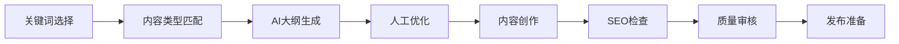

# Eufy GEO 30天执行文档 - 项目阶段和功能模块拆解

## 一、项目阶段划分

### 第1周：战略准备期
**目标**：建立坚实的SEO基础和明确的执行方向

**核心任务**：
1. **关键词审核** - 全面评估现有关键词库，进行P0-P5优先级分层
2. **核心关键词选择** - 识别30个高ROI核心关键词
3. **客户策略汇报** - 制定并展示30天执行计划

**详细模板**：
- 关键词审核模板（Keyword Audit Template）
- 核心关键词选择模板（Core Keyword Selection Template）
- 客户汇报模板（Client Reporting Template）

### 第2周：内容规划期  
**目标**：制定多渠道内容策略，确保内容质量和SEO效果

**核心任务**：
1. **长文内容大纲** - 创建10-15篇SEO优化文章框架
2. **视频脚本编写** - 开发5-8个YouTube优化视频脚本
3. **Reddit社区研究** - 分析目标子版块和用户偏好

**详细模板**：
- 内容大纲模板（Content Outline Template）
- 视频脚本模板（Video Script Template）
- Reddit研究模板（Reddit Research Template）

### 第3周：生产执行期
**目标**：高质量内容生产和多渠道发布

**核心任务**：
1. **内容生产管理** - 执行质量控制清单，确保一致性
2. **视频制作跟踪** - 监控制作进度和优化要点
3. **Reddit营销执行** - 实施社区参与策略

**详细模板**：
- 内容生产清单（Content Production Checklist）
- 视频跟踪表（Video Tracking Sheet）
- Reddit发布策略（Reddit Posting Strategy）

### 第4周：优化迭代期
**目标**：数据分析、效果评估和持续优化

**核心任务**：
1. **性能数据分析** - 评估流量、排名、转化等KPI
2. **内容优化调整** - 基于数据反馈优化内容
3. **成果总结汇报** - 制作月度报告和下月计划

**详细模板**：
- 数据分析仪表板（Data Analysis Dashboard）
- 内容优化清单（Content Optimization Checklist）
- 月度总结报告（Monthly Summary Report）

## 二、系统功能模块设计

### 1. 关键词管理模块

#### 功能设计
```
核心功能：
- P0-P5优先级分层系统（基于月搜索量）
  - P0: 100K+ （超高流量，战略核心）
  - P1: 50K-100K （高流量，重点投入）
  - P2: 20K-50K （中高流量，稳定发展）
  - P3: 10K-20K （中等流量，选择投入）
  - P4: 5K-10K （低流量，长尾机会）
  - P5: <5K （微流量，精准定位）

高级功能：
- Google AIO（AI Overview）适配性评分
- 竞争难度分析（基于DA、PA、内容质量）
- 内容映射管理（关键词→内容类型→发布渠道）
- 季节性趋势预测
- 搜索意图分类（信息型/交易型/导航型）
```

#### 技术实现
```javascript
// 关键词分级算法
const keywordPrioritySystem = {
  calculatePriority: (monthlySearchVolume) => {
    if (monthlySearchVolume >= 100000) return 'P0';
    if (monthlySearchVolume >= 50000) return 'P1';
    if (monthlySearchVolume >= 20000) return 'P2';
    if (monthlySearchVolume >= 10000) return 'P3';
    if (monthlySearchVolume >= 5000) return 'P4';
    return 'P5';
  },
  
  aioAdaptabilityScore: (keyword) => {
    // 基于关键词特征计算AIO适配分数
    const factors = {
      questionFormat: keyword.includes('how') || keyword.includes('what'),
      informationalIntent: true,
      featuredSnippetPotential: true,
      competitorAIOPresence: false
    };
    return calculateScore(factors);
  }
};
```

### 2. 内容生产模块

#### 功能设计
```
内容类型支持：
1. 长文内容（Long-form Content）
   - 字数要求：2000-5000字
   - SEO元素：H1-H3结构、内链、LSI关键词
   - 用户体验：目录、摘要、相关推荐

2. 视频脚本（Video Scripts）
   - 时长规划：5-15分钟
   - 结构要素：钩子、主体、CTA
   - YouTube优化：标签、描述、时间戳

3. Reddit内容（Reddit Posts）
   - 社区规则适配
   - 价值导向内容
   - 自然语言风格

AI辅助功能：
- 智能大纲生成
- SEO评分实时反馈
- 多语言翻译优化
- 内容原创性检测
```

#### 工作流设计


### 3. 渠道管理模块

#### Google搜索优化
```
技术要素：
- 页面优化
  - Title标签优化（55-60字符）
  - Meta描述优化（155-160字符）
  - URL结构优化
  - Schema标记实施

- 内容优化
  - 关键词密度控制（1-2%）
  - LSI关键词覆盖
  - 内部链接策略
  - 图片Alt标签

- 技术SEO
  - 页面加载速度
  - 移动友好性
  - Core Web Vitals
```

#### YouTube视频SEO
```
优化要素：
- 视频元数据
  - 标题优化（关键词前置）
  - 描述优化（首200字符）
  - 标签策略（15-20个相关标签）

- 参与度优化
  - 缩略图A/B测试
  - 片头优化（0-15秒黄金时段）
  - 互动元素（投票、问答）

- 算法信号
  - 观看时长优化
  - 点击率提升
  - 评论互动管理
```

#### Reddit社区营销
```
策略要素：
- 社区选择
  - 相关性评分
  - 活跃度分析
  - 规则研究

- 内容策略
  - 80/20原则（80%价值，20%推广）
  - 本地化语言
  - 时机选择

- 参与管理
  - 评论回复
  - 社区贡献
  - 信任建立
```

### 4. 工作流自动化模块

#### 4周循环引擎
```
Week 1 Tasks:
├── 关键词审核（自动）
│   ├── 数据抓取
│   ├── 优先级计算
│   └── 报告生成
├── 核心选择（半自动）
│   ├── AI推荐
│   ├── 人工确认
│   └── 策略制定
└── 客户汇报（模板化）
    ├── 数据整合
    ├── 可视化
    └── 演示准备

Week 2-4: [类似结构]
```

#### 任务管理系统
```javascript
const taskTemplate = {
  week1: {
    day1: ['关键词数据收集', '竞争对手分析'],
    day2: ['P0-P2关键词筛选', 'AIO机会识别'],
    day3: ['内容映射规划', 'ROI预估'],
    day4: ['策略文档编写', '团队分工'],
    day5: ['客户报告准备', '汇报演练']
  }
  // ... 其他周
};
```

### 5. 数据分析模块

#### KPI监控体系
```
核心指标：
1. 流量指标
   - 自然搜索流量（+25%目标）
   - 直接流量
   - 推荐流量

2. 排名指标
   - P0关键词排名（Top 3目标）
   - P1关键词排名（Top 5目标）
   - 整体排名提升率

3. 参与度指标
   - 页面停留时间
   - 跳出率
   - 页面浏览深度

4. 转化指标
   - 目标完成率
   - 微转化追踪
   - ROI计算
```

#### 竞争情报系统
```
监控维度：
- 关键词覆盖对比
- 内容更新频率
- 反向链接增长
- 社交媒体活跃度
- 新功能/产品发布
```

### 6. 报告生成模块

#### 报告模板系统
```
报告类型：
1. 周报（Weekly Report）
   - 执行进度
   - 关键成果
   - 问题及解决方案
   - 下周计划

2. 月报（Monthly Report）
   - KPI达成分析
   - ROI详细计算
   - 竞争态势分析
   - 战略调整建议

3. 客户报告（Client Report）
   - 执行摘要
   - 视觉化数据
   - 成功案例
   - 投资回报
```

## 三、技术实施路线图

### Phase 1：基础集成（第1周）
```
任务清单：
□ 系统架构设计
  □ 数据库schema扩展
  □ API接口设计
  □ 前端路由规划

□ 核心功能开发
  □ P0-P5分级系统实现
  □ 工作流框架搭建
  □ 模板导入功能
  
□ 用户界面
  □ 项目向导设计
  □ 仪表板布局
  □ 导航优化
```

### Phase 2：核心功能开发（第2-3周）
```
任务清单：
□ 内容管理系统
  □ 多渠道内容编辑器
  □ SEO实时检查
  □ 版本控制
  
□ AI集成
  □ 内容生成API
  □ 优化建议引擎
  □ 自然语言处理
  
□ 自动化工作流
  □ 任务调度器
  □ 通知系统
  □ 审批流程
```

### Phase 3：高级功能（第4周）
```
任务清单：
□ 实时监控
  □ 性能指标追踪
  □ 异常警报
  □ 趋势预测
  
□ 智能推荐
  □ 内容推荐算法
  □ 关键词建议
  □ 优化策略推荐
  
□ 第三方集成
  □ Google APIs
  □ YouTube Data API
  □ Reddit API
```

### Phase 4：持续优化
```
优化方向：
- 性能优化
  - 查询优化
  - 缓存策略
  - 异步处理

- 用户体验
  - 操作流程简化
  - 响应速度提升
  - 移动端适配

- 智能化升级
  - 机器学习模型
  - 预测分析
  - 个性化推荐
```

## 四、预期成果与ROI分析

### 效率提升指标
| 指标 | 当前值 | 目标值 | 提升幅度 |
|------|--------|--------|----------|
| 内容生产周期 | 5天 | 2.5天 | 50% |
| 关键词研究时间 | 8小时 | 2小时 | 75% |
| 报告生成时间 | 4小时 | 30分钟 | 87.5% |
| 团队协作效率 | - | - | 40% |

### 业务成果预期
| KPI | 第1个月 | 第2个月 | 第3个月 |
|-----|---------|---------|---------|
| 自然流量增长 | +25% | +40% | +60% |
| 关键词Top10 | 50个 | 120个 | 200个 |
| AIO覆盖率 | 30% | 50% | 70% |
| 内容ROI | 1.5x | 2.5x | 4x |

### 竞争优势构建
1. **标准化优势**
   - 行业领先的执行标准
   - 可复制的成功模式
   - 质量保证体系

2. **技术优势**
   - AI驱动的内容优化
   - 实时数据分析
   - 自动化工作流

3. **速度优势**
   - 快速内容生产
   - 敏捷响应市场
   - 持续迭代优化

## 五、实施建议

### 快速启动清单
1. **第1天**：导入30天执行模板，创建首个项目
2. **第3天**：完成关键词P0-P5分级，启动内容规划
3. **第7天**：首批内容上线，开始数据收集
4. **第14天**：首次数据分析，优化调整
5. **第30天**：完整周期总结，制定下月计划

### 成功关键因素
- **执行纪律**：严格按照4周计划执行
- **数据驱动**：所有决策基于数据支撑
- **持续优化**：每周回顾并改进流程
- **团队协作**：明确分工，高效沟通
- **技术支撑**：充分利用平台自动化功能

### 风险管理
| 风险类型 | 预防措施 | 应对方案 |
|----------|----------|----------|
| 内容质量下降 | 严格审核流程 | 增加人工复查 |
| 技术故障 | 定期备份 | 快速恢复机制 |
| 团队抗拒 | 培训和激励 | 渐进式推进 |
| 市场变化 | 实时监控 | 敏捷调整策略 |

## 总结

Eufy GEO 30天执行文档提供了一个经过验证的SEO执行框架。通过将其与现代技术平台深度集成，我们能够：

1. **标准化执行流程**，确保每个项目的质量和一致性
2. **提升工作效率**，通过自动化和AI辅助大幅节省时间
3. **优化业务成果**，基于数据驱动实现持续增长
4. **构建竞争优势**，在SEO执行能力上领先同行

这个集成方案不仅是工具的升级，更是整个SEO执行理念的革新。通过系统化、智能化、自动化的方式，让SEO从艺术变成可预测、可复制、可扩展的科学。