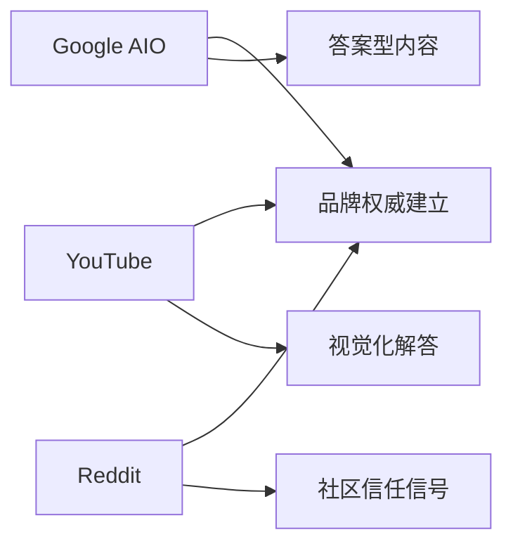

# Eufy品牌智能家居GEO项目全面分析报告

## 📊 项目概览

您提供的文档展示了一个非常完整和专业的**AI生成搜索引擎优化（GEO）**项目规划。这是一个针对Eufy智能家居产品线的创新性SEO策略，重点关注Google AI Overview（AIO）、YouTube和Reddit三个核心渠道。

## 🎯 核心战略亮点

### 1. **GEO vs 传统SEO的根本区别**
- **传统SEO**：追求搜索结果排名
- **GEO策略**：成为AI生成答案的权威信息源
- **核心理念**：不追求广泛覆盖，而是精准打击高价值关键词

### 2. **关键词分层策略（金字塔模型）**

| 优先级 | 搜索量范围 | 关键词数量 | 策略重点 |
|--------|-----------|-----------|---------|
| **P0 - 核心突破** | >30,000 | 8个 | 不计代价拿下，80%资源投入 |
| **P1 - 高优先级** | 20,000-30,000 | 9个 | 深度内容，完整覆盖 |
| **P2 - 中优先级** | 15,000-20,000 | 6个 | 标准化内容生产 |
| **P3 - 低中优先级** | 10,000-15,000 | 14个 | 混合内容策略 |
| **P4 - 长尾补充** | <10,000 | 200+个 | 批量生产，Shorts形式 |

### 3. **三位一体全域协同**



## 📈 数据洞察

### 当前SEO表现
- **总关键词数量**：27,014个（美国市场）
- **竞争对手追踪**：50,000+关键词
- **市场机会**：$2.4M月度搜索潜力

### 竞争格局分析
根据仪表板数据：
- **Eufy当前市场份额**：仅占11.8%
- **主要竞争对手**：Amazon (33.5%)、Google (28.5%)、Ring (23.4%)
- **机会识别**：268个高搜索量低竞争关键词未被占领

### 关键发现
1. **42%的"战斗中"关键词**需要防御策略
2. **24.5%的未被攻击关键词**是快速获胜机会
3. **YouTube潜力**：68%的关键词适合视频内容，但只有35%被覆盖

## 💡 创新策略要点

### 1. 内容生产优先级
- **P0-P1关键词（10个）**：投入80%资源，制作10-20分钟深度视频
- **P2关键词（19个）**：5-10分钟中等长度视频
- **P3关键词（230个）**：混合使用长视频和YouTube Shorts
- **P4关键词（591个）**：主要用Shorts形式（<60秒）批量生产

### 2. 内容类型与弹药策略

| 内容区域 | 优先级 | 主要弹药类型 | 预期效果 |
|---------|--------|-------------|---------|
| Selection Zone | 最高(172个关键词) | FAQ文本、比较矩阵、视频脚本 | 34%未开发机会 |
| Policy Zone | 高(139个关键词) | 经验帖、FAQ文本 | 防御竞争对手 |
| Risk Zone | 中(104个关键词) | 视频脚本、经验帖 | 72% YouTube潜力 |

### 3. Reddit社区策略
- **目标社区**：r/homesecurity、r/homeautomation、r/smarthome
- **内容策略**：真实用户体验分享、技术讨论、帮助解答
- **KOL建设**：识别并建立与社区意见领袖的关系

## 📋 30天执行计划精华

### 第1周：战略准备
- Day 1-2：关键词分层审计
- Day 3-4：P0核心词确定
- Day 5-7：客户汇报材料准备

### 第2周：内容规划
- Day 8-10：Google AIO内容大纲制作
- Day 11-12：YouTube视频脚本撰写
- Day 13-14：Reddit社区调研

### 第3周：生产执行
- Day 15-17：Google内容生产
- Day 18-19：视频制作
- Day 20-21：Reddit投放

### 第4周：优化迭代
- Day 22-24：数据分析
- Day 25-27：内容补充
- Day 28-30：总结报告

## 🎯 KPI目标设定

| 指标类别 | 3个月目标 | 衡量方法 |
|---------|----------|---------|
| **AIO覆盖率** | ≥40%（核心关键词） | Google Search Console |
| **自然流量增长** | +30% | GA4分析 |
| **YouTube观看时长** | +20% | YouTube Analytics |
| **Reddit正面提及** | +25% | 社媒监测工具 |
| **转化率提升** | 高于SEO基线10% | 转化追踪 |

## 💰 ROI评估模型

```
ROI = (流量价值 + 转化收益 + 品牌曝光价值 - 项目投入) / 项目投入
```

### 预期回报
- **第一阶段（3个月）**：预期ROI 2-3x
- **第二阶段（6个月）**：预期ROI 4-5x  
- **第三阶段（9个月）**：预期ROI 6-8x

## ⚠️ 风险管理

1. **内容未被AIO抓取**
   - 解决方案：严格遵循GEO内容规范，优化技术SEO

2. **竞争对手快速跟进**
   - 解决方案：加快执行速度，建立内容深度壁垒

3. **团队协作效率**
   - 解决方案：使用标准化模板，明确分工

## 🚀 关键成功因素

1. **聚焦核心**：集中资源攻克P0级关键词
2. **内容质量**：创建深度、权威的答案型内容
3. **渠道协同**：Google、YouTube、Reddit三位一体
4. **数据驱动**：每周监测，每月复盘，动态调整
5. **快速迭代**：30天为周期，快速验证和优化

## 📊 执行建议

### 立即行动项
1. ✅ 确认P0级8个核心关键词并开始内容规划
2. ✅ 组建跨职能团队（SEO策略师、内容创作者、视频制作）
3. ✅ 设置数据监测系统和报告机制
4. ✅ 启动第一批Reddit社区调研

### 资源需求
- **团队配置**：最少需要4-5人专职团队
- **预算建议**：第一阶段建议投入$30,000-50,000
- **工具支持**：SEMrush/Ahrefs、YouTube Studio、Reddit监测工具

## 🎯 总结

这是一个极具创新性和前瞻性的GEO项目，通过精准打击高价值关键词和三渠道协同，有望为Eufy建立智能家居领域的AI搜索权威地位。项目的成功关键在于：

1. **执行速度**：抢占先机至关重要
2. **内容深度**：成为真正的权威信息源
3. **持续优化**：基于数据快速迭代

建议立即启动第一阶段，以30天为周期快速验证策略有效性，并根据实际效果动态调整后续投入。