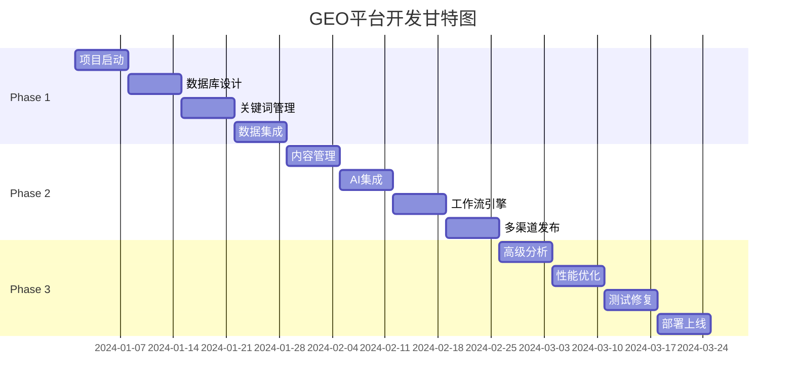

# Eufy GEO 平台实施计划

## 项目概述

**项目名称**: Eufy GEO 协同作战平台  
**项目周期**: 3个月（12周）  
**团队规模**: 8-10人  
**技术栈**: Next.js + NestJS + PostgreSQL + Neo4j + AI Integration

## 团队组成

| 角色 | 人数 | 职责 |
|-----|------|------|
| 项目经理 | 1 | 项目管理、进度跟踪、风险控制 |
| 技术负责人 | 1 | 架构设计、技术决策、代码审查 |
| 后端开发 | 3 | API开发、数据库设计、集成开发 |
| 前端开发 | 2 | UI开发、用户体验、前端架构 |
| AI工程师 | 1 | AI集成、模型优化、智能功能 |
| 测试工程师 | 1 | 测试计划、自动化测试、质量保证 |
| DevOps | 1 | 基础设施、CI/CD、部署运维 |

## 实施阶段划分

### 🚀 Phase 1: 基础设施与核心功能（第1-4周）

#### Week 1: 项目启动与环境搭建
- [ ] 项目启动会议，明确目标和职责
- [ ] 开发环境搭建（Docker、数据库、开发工具）
- [ ] 代码仓库初始化，CI/CD 基础配置
- [ ] 技术栈培训（如需要）

**交付物**:
- 项目章程
- 开发环境文档
- CI/CD 流水线（基础版）

#### Week 2: 数据库设计与后端基础
- [ ] PostgreSQL 数据库详细设计
- [ ] Neo4j 图数据库模型设计
- [ ] Prisma ORM 配置与模型生成
- [ ] NestJS 项目结构搭建
- [ ] 认证授权模块开发（JWT）

**交付物**:
- 数据库设计文档
- 基础 API 框架
- 用户认证系统

#### Week 3: 关键词管理核心功能
- [ ] 关键词 CRUD API 开发
- [ ] CSV 批量导入功能
- [ ] P0-P4 自动分层算法
- [ ] 关键词管理前端页面
- [ ] 基础筛选和搜索功能

**交付物**:
- 关键词管理 MVP
- 数据导入工具
- API 文档 v1

#### Week 4: 数据集成与监控基础
- [ ] Google Search Console API 集成
- [ ] 基础数据采集服务
- [ ] AIO 状态监测功能
- [ ] 简单的数据可视化仪表板

**交付物**:
- 数据集成服务
- 监控仪表板 MVP
- 第一阶段演示

### 📝 Phase 2: 内容管理与工作流（第5-8周）

#### Week 5: 内容管理系统
- [ ] 内容编辑器集成（Lexical）
- [ ] 内容 CRUD API
- [ ] 版本控制功能
- [ ] 内容与关键词关联

**交付物**:
- 内容管理模块
- 富文本编辑器
- 版本历史功能

#### Week 6: AI 集成与智能功能
- [ ] OpenAI/Claude API 集成
- [ ] 内容大纲自动生成
- [ ] AI 优化建议功能
- [ ] 内容评分系统
- [ ] Qdrant 向量数据库配置

**交付物**:
- AI 服务模块
- 智能写作助手
- 内容优化工具

#### Week 7: 工作流引擎
- [ ] 审核流程设计与开发
- [ ] 任务分配系统
- [ ] 通知系统（邮件、站内信）
- [ ] 协作功能（评论、批注）

**交付物**:
- 工作流引擎
- 任务管理系统
- 通知中心

#### Week 8: 多渠道发布系统
- [ ] YouTube API 集成
- [ ] Reddit API 集成
- [ ] 发布调度功能
- [ ] 跨渠道内容同步

**交付物**:
- 多渠道发布工具
- 内容日历
- 第二阶段演示

### 📊 Phase 3: 数据分析与优化（第9-12周）

#### Week 9: 高级分析功能
- [ ] 竞争对手分析模块
- [ ] ROI 计算引擎
- [ ] 趋势分析与预测
- [ ] 自定义报表生成器

**交付物**:
- 分析模块
- 报表系统
- 数据导出功能

#### Week 10: 性能优化与扩展
- [ ] 数据库查询优化
- [ ] Redis 缓存实现
- [ ] API 性能优化
- [ ] 前端性能优化
- [ ] 负载测试

**交付物**:
- 性能优化报告
- 缓存策略文档
- 负载测试结果

#### Week 11: 测试与修复
- [ ] 完整的功能测试
- [ ] 安全测试
- [ ] 用户验收测试（UAT）
- [ ] Bug 修复
- [ ] 文档完善

**交付物**:
- 测试报告
- 已修复的稳定版本
- 用户手册

#### Week 12: 部署与上线
- [ ] 生产环境部署
- [ ] 数据迁移
- [ ] 监控配置
- [ ] 用户培训
- [ ] 项目交付

**交付物**:
- 生产环境系统
- 运维文档
- 培训材料
- 项目总结报告

## 里程碑时间表

## 关键里程碑

| 里程碑 | 日期 | 交付物 | 成功标准 |
|--------|------|--------|----------|
| M1: 基础平台 | Week 4 | 关键词管理MVP、数据监控 | 可导入关键词并查看AIO状态 |
| M2: 内容系统 | Week 8 | 完整内容管理、AI助手、工作流 | 端到端内容创作流程可用 |
| M3: 正式发布 | Week 12 | 完整GEO平台 | 所有核心功能可用，性能达标 |

## 风险管理

### 技术风险
| 风险 | 影响 | 缓解措施 |
|------|------|----------|
| API限流 | 高 | 实现请求队列和缓存策略 |
| AI成本超支 | 中 | 设置使用配额，优化提示词 |
| 数据库性能 | 中 | 提前进行性能测试和优化 |

### 项目风险
| 风险 | 影响 | 缓解措施 |
|------|------|----------|
| 需求变更 | 高 | 采用敏捷开发，每周评审 |
| 人员流动 | 中 | 详细文档，知识共享 |
| 集成复杂度 | 中 | 预留集成测试时间 |

## 质量保证

### 代码质量
- 代码审查：所有 PR 需要至少一人审查
- 单元测试覆盖率：>80%
- 集成测试：核心流程100%覆盖
- 代码规范：ESLint + Prettier 强制执行

### 性能指标
- API 响应时间：P95 < 200ms
- 页面加载时间：< 2s
- 并发用户数：支持 1000+
- 系统可用性：99.9%

### 安全要求
- OWASP Top 10 合规
- 数据加密存储
- API 限流保护
- 完整的审计日志

## 交付标准

### 功能交付
- [ ] 850+ 关键词分层管理
- [ ] AI 辅助内容创作
- [ ] 多渠道统一发布
- [ ] 实时数据监控
- [ ] ROI 分析报告

### 文档交付
- [ ] 系统架构文档
- [ ] API 接口文档
- [ ] 用户使用手册
- [ ] 运维部署指南
- [ ] 测试报告

### 培训交付
- [ ] 管理员培训（4小时）
- [ ] 内容创作者培训（2小时）
- [ ] 运维人员培训（2小时）
- [ ] 培训视频录制

## 项目预算估算

| 类别 | 项目 | 预算 |
|------|------|------|
| 人力成本 | 10人×3个月 | ¥600,000 |
| 云服务 | AWS/阿里云 | ¥30,000 |
| 第三方API | OpenAI、GSC等 | ¥20,000 |
| 软件许可 | 开发工具、监控等 | ¥10,000 |
| **总计** | | **¥660,000** |

## 后续维护计划

### 第一年维护
- 月度安全更新
- 季度功能迭代
- 7×24 监控告警
- 4小时响应 SLA

### 持续改进
- 用户反馈收集
- 性能持续优化
- AI 模型更新
- 新渠道集成

## 成功标准

1. **技术成功**
   - 系统稳定运行30天无重大故障
   - 性能指标全部达标
   - 安全测试通过

2. **业务成功**
   - P0关键词AIO覆盖率 >40%
   - 内容生产效率提升 50%
   - 用户满意度 >85%

3. **项目成功**
   - 按时交付
   - 预算控制在±10%以内
   - 团队知识转移完成

---

*本计划为初始版本，将根据实际进展进行调整。*