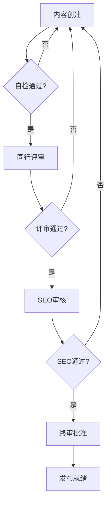

# PRD - Eufy GEO Platform 30天执行系统
**产品需求文档 | Product Requirements Document**

---

## 文档信息
- **版本**: 1.0
- **日期**: 2025-09-18
- **作者**: Eufy GEO产品团队
- **审批者**: 产品总监、技术总监、运营总监
- **状态**: 草案

---

## 目录
1. [执行摘要](#执行摘要)
2. [产品背景与目标](#产品背景与目标)
3. [用户角色定义](#用户角色定义)
4. [功能需求](#功能需求)
   - [模块1：关键词管理系统](#模块1关键词管理系统)
   - [模块2：内容生产系统](#模块2内容生产系统)
   - [模块3：渠道管理系统](#模块3渠道管理系统)
   - [模块4：工作流自动化系统](#模块4工作流自动化系统)
   - [模块5：数据分析系统](#模块5数据分析系统)
   - [模块6：报告生成系统](#模块6报告生成系统)
5. [非功能需求](#非功能需求)
6. [技术架构要求](#技术架构要求)
7. [数据需求](#数据需求)
8. [集成需求](#集成需求)
9. [成功指标](#成功指标)
10. [附录](#附录)

---

## 执行摘要

### 产品概述
Eufy GEO Platform 30天执行系统是一个集成化的SEO管理平台，通过标准化的4周循环工作流，帮助Eufy品牌系统化地提升搜索引擎表现。该系统整合了AI技术、自动化工作流和数据分析能力，实现SEO执行的标准化、智能化和规模化。

### 核心价值主张
1. **效率提升50%**：通过自动化和AI辅助，大幅降低人工工作量
2. **ROI提升4倍**：数据驱动的决策支持，优化资源投入产出比
3. **执行标准化**：将最佳实践固化为系统流程，确保质量一致性
4. **快速规模化**：支持多项目并行管理，快速复制成功模式

### 目标用户
- SEO经理和专员
- 内容营销团队
- 数据分析师
- 项目管理人员
- 高层管理者

---

## 产品背景与目标

### 业务背景
1. **市场挑战**
   - Google算法持续更新，特别是AI Overview的推出改变了SEO格局
   - 竞争对手在SEO投入持续增加，市场竞争日益激烈
   - 内容生产效率低下，难以满足多渠道发布需求
   - 缺乏标准化流程，执行质量参差不齐

2. **机会识别**
   - 30天执行模板已经过市场验证，效果显著
   - AI技术成熟，可大幅提升内容生产效率
   - 数据分析能力提升，支持更精准的决策
   - 团队协作需求增长，需要系统化支持

### 产品目标

#### 短期目标（3个月）
- 完成6大核心模块开发并上线
- 支持10个并行项目管理
- 内容生产效率提升50%
- 月度自然流量增长25%

#### 中期目标（6个月）
- 覆盖全部Eufy产品线的SEO管理
- AI内容生成准确率达到85%
- 关键词Top 10覆盖率达到60%
- 系统稳定性达到99.9%

#### 长期目标（12个月）
- 成为行业领先的SEO执行平台
- 支持多品牌、多语言、多市场
- ROI提升4倍以上
- 可对外商业化

---

## 用户角色定义

### 主要用户角色

#### 1. SEO经理（SEO Manager）
**特征**：
- 5年以上SEO经验
- 负责整体SEO策略制定
- 关注ROI和业务成果

**需求**：
- 全局视角的数据仪表板
- 灵活的策略调整能力
- 团队绩效管理工具
- 高层汇报材料生成

**使用场景**：
- 制定月度SEO策略
- 分配团队任务
- 监控执行进度
- 生成管理报告

#### 2. SEO专员（SEO Specialist）
**特征**：
- 2-5年SEO经验
- 负责具体执行工作
- 注重操作效率

**需求**：
- 清晰的任务列表
- 高效的内容工具
- 实时的性能反馈
- 协作沟通功能

**使用场景**：
- 执行关键词研究
- 创建优化内容
- 监控排名变化
- 优化现有内容

#### 3. 内容创作者（Content Creator）
**特征**：
- 专注内容质量
- 可能缺乏SEO知识
- 追求创作效率

**需求**：
- 智能内容建议
- SEO写作指导
- 多格式支持
- 版本管理

**使用场景**：
- 撰写长文内容
- 创建视频脚本
- 编辑社交内容
- 内容本地化

#### 4. 数据分析师（Data Analyst）
**特征**：
- 精通数据分析
- 关注指标准确性
- 提供决策支持

**需求**：
- 全面的数据接入
- 灵活的分析工具
- 自定义报表
- 数据导出功能

**使用场景**：
- 深度数据分析
- 趋势预测
- 竞争对手研究
- ROI计算

#### 5. 高层管理者（Executive）
**特征**：
- 关注业务成果
- 需要高层次总结
- 时间有限

**需求**：
- 执行摘要仪表板
- 关键指标监控
- 投资回报分析
- 移动端访问

**使用场景**：
- 查看月度成果
- 审批重大决策
- 了解市场地位
- 评估团队绩效

---

## 功能需求

### 模块1：关键词管理系统

#### 1.1 用户故事
**作为SEO经理，我希望能够：**
- US-1.1: 快速导入和分类大量关键词，以便制定优化策略
- US-1.2: 查看关键词的P0-P5优先级分布，以便合理分配资源
- US-1.3: 评估关键词的AIO适配性，以便抓住AI搜索机会
- US-1.4: 跟踪关键词排名变化，以便及时调整策略

#### 1.2 功能规格

##### 1.2.1 关键词导入与管理
**功能描述**：
支持多种方式导入关键词，自动进行清洗和去重，并基于搜索量进行P0-P5分级。

**详细需求**：
- 支持CSV、Excel批量导入（最多10,000个关键词/次）
- 支持从Google Keyword Planner API直接导入
- 自动去重和标准化处理
- 保留历史版本，支持回滚

**界面要求**：
```
┌─────────────────────────────────────────┐
│  关键词导入                              │
│  ┌─────────────────────────────────┐    │
│  │ 拖拽文件到此处或点击上传          │    │
│  │                                   │    │
│  │    支持格式：CSV, XLSX            │    │
│  └─────────────────────────────────┘    │
│                                         │
│  [立即导入]  [模板下载]  [取消]         │
└─────────────────────────────────────────┘
```

##### 1.2.2 P0-P5优先级系统
**功能描述**：
基于月搜索量自动分级，支持手动调整，可视化展示分布情况。

**分级规则**：
| 级别 | 月搜索量 | 颜色标识 | 资源投入建议 |
|-----|----------|---------|--------------|
| P0 | 100K+ | 深红 | 最高优先级，全力投入 |
| P1 | 50K-100K | 红色 | 高优先级，重点投入 |
| P2 | 20K-50K | 橙色 | 中高优先级，稳定投入 |
| P3 | 10K-20K | 黄色 | 中等优先级，选择投入 |
| P4 | 5K-10K | 蓝色 | 低优先级，机会投入 |
| P5 | <5K | 灰色 | 最低优先级，长尾策略 |

**交互设计**：
- 拖拽调整优先级
- 批量修改功能
- 优先级变更历史记录
- 自定义规则设置

##### 1.2.3 AIO适配性评分
**功能描述**：
评估关键词在Google AI Overview中的表现潜力，提供优化建议。

**评分维度**：
1. **问题类型匹配度**（30%）
   - How-to类问题：+30分
   - What/Why/When类：+20分
   - 比较类问题：+25分
   - 定义类问题：+15分

2. **搜索意图清晰度**（25%）
   - 信息型意图：+25分
   - 交易型意图：+10分
   - 导航型意图：+5分

3. **内容结构适配性**（25%）
   - 列表式内容：+20分
   - 步骤式内容：+25分
   - 问答式内容：+22分

4. **竞争环境**（20%）
   - 已有AIO结果：-10分
   - 竞争对手未覆盖：+20分
   - 内容质量机会：+15分

**输出结果**：
- 0-100分的AIO适配性得分
- 具体优化建议
- 预期表现预测

##### 1.2.4 关键词性能追踪
**功能描述**：
实时监控关键词排名变化，提供趋势分析和预警功能。

**监控指标**：
- 当前排名位置
- 排名变化趋势（日/周/月）
- SERP特性（精选摘要、AIO等）
- 点击率和展示量
- 竞争对手排名

**预警规则**：
- P0/P1关键词排名下降超过3位
- 新竞争对手进入前10
- SERP特性发生变化
- 搜索量异常波动

#### 1.3 验收标准
1. **功能完整性**
   - [ ] 可成功导入10,000个关键词并在5秒内完成分级
   - [ ] P0-P5分级准确率达到95%以上
   - [ ] AIO评分算法经过100+关键词验证
   - [ ] 排名数据更新延迟不超过24小时

2. **性能要求**
   - [ ] 页面加载时间 < 2秒
   - [ ] 批量操作响应时间 < 5秒
   - [ ] 支持100万级关键词存储

3. **用户体验**
   - [ ] 界面直观，新用户5分钟内可上手
   - [ ] 提供操作引导和帮助文档
   - [ ] 支持撤销/重做操作

---

### 模块2：内容生产系统

#### 2.1 用户故事
**作为内容创作者，我希望能够：**
- US-2.1: 基于关键词快速生成内容大纲，提高创作效率
- US-2.2: 获得实时的SEO优化建议，确保内容质量
- US-2.3: 管理多种内容格式（文章、视频、社交），统一工作流程
- US-2.4: 使用AI辅助功能，但保持内容的原创性和品牌调性

#### 2.2 功能规格

##### 2.2.1 智能内容大纲生成器
**功能描述**：
基于目标关键词和竞争对手分析，自动生成SEO优化的内容大纲。

**生成流程**：


**大纲要素**：
1. **标题结构**
   - H1主标题（包含核心关键词）
   - H2子标题（4-6个，覆盖长尾词）
   - H3详细点（每个H2下2-3个）

2. **内容要点**
   - 每个段落的核心观点
   - 支撑数据和案例建议
   - 内部链接机会标记
   - 多媒体内容建议

3. **SEO元素**
   - 元标题和描述
   - 关键词密度建议
   - LSI关键词列表
   - 图片Alt标签建议

##### 2.2.2 多格式内容编辑器
**功能描述**：
统一的内容创作界面，支持长文、视频脚本、社交内容等多种格式。

**长文编辑器功能**：
- 富文本编辑（支持Markdown）
- 实时字数和阅读时间统计
- SEO得分实时计算
- 内容结构可视化
- 协作评论功能
- 版本历史管理

**视频脚本编辑器**：
- 时间轴管理
- 场景划分
- 台词和画面说明
- SEO标签建议
- 导出多种格式

**社交内容编辑器**：
- 平台特定模板（Reddit、Twitter等）
- 字符限制提醒
- Hashtag建议
- 最佳发布时间推荐

##### 2.2.3 AI写作助手
**功能描述**：
提供智能写作建议，但确保内容原创性和品牌一致性。

**AI功能模块**：
1. **开头段落生成**
   - 基于标题生成3个开头选项
   - 包含钩子和关键词
   - 符合品牌语调

2. **段落扩展**
   - 将要点扩展为完整段落
   - 保持逻辑连贯性
   - 控制段落长度

3. **结尾优化**
   - 总结要点
   - 添加行动号召（CTA）
   - 引导用户互动

4. **语言优化**
   - 语法检查
   - 可读性优化
   - 专业术语解释

**原创性保障**：
- AI生成内容标记
- 相似度检测（<15%）
- 人工审核流程
- 引用来源管理

##### 2.2.4 SEO实时优化检查
**功能描述**：
在内容创作过程中提供实时的SEO优化反馈和建议。

**检查项目**：
| 检查类别 | 具体项目 | 权重 |
|---------|---------|------|
| 关键词优化 | 标题包含关键词、密度1-2%、自然分布 | 30% |
| 内容结构 | H标签使用、段落长度、列表使用 | 25% |
| 可读性 | Flesch分数、句子长度、被动语态 | 20% |
| 技术SEO | 元数据、图片优化、内链 | 15% |
| 用户体验 | 内容深度、多媒体使用、CTA | 10% |

**优化建议示例**：
```
⚠️ SEO优化建议：
1. 主关键词"eufy security camera"在前100词中未出现
2. H2标签缺少长尾关键词覆盖
3. 段落平均长度超过150词，建议拆分
4. 缺少内部链接到相关产品页面
✅ 做得好的地方：
1. 标题包含核心关键词
2. 使用了编号列表提高可读性
```

#### 2.3 验收标准
1. **内容质量**
   - [ ] AI生成大纲准确率85%以上
   - [ ] 内容原创度>85%
   - [ ] SEO评分准确性经专家验证

2. **生产效率**
   - [ ] 大纲生成时间<30秒
   - [ ] 内容创作时间减少50%
   - [ ] 支持10人同时协作

3. **系统集成**
   - [ ] 与关键词模块无缝对接
   - [ ] 内容可直接发布到CMS
   - [ ] 数据同步到分析模块

---

### 模块3：渠道管理系统

#### 3.1 用户故事
**作为渠道运营人员，我希望能够：**
- US-3.1: 统一管理Google、YouTube、Reddit等多渠道内容发布
- US-3.2: 针对不同渠道特性优化内容展现形式
- US-3.3: 追踪各渠道的内容表现并快速调整策略
- US-3.4: 实现跨渠道的内容协同和数据打通

#### 3.2 功能规格

##### 3.2.1 Google搜索优化管理
**功能描述**：
专门针对Google搜索的内容优化和管理功能。

**核心功能**：
1. **页面优化工作台**
   - Title标签优化器（55-60字符限制）
   - Meta描述生成器（155-160字符限制）
   - URL结构建议器
   - Schema标记生成器

2. **技术SEO检查**
   - 页面速度分析（Core Web Vitals）
   - 移动友好性测试
   - 爬虫可访问性检查
   - 站点地图管理

3. **SERP预览**
   - 桌面/移动端预览
   - 富媒体结果模拟
   - 竞争对手对比

##### 3.2.2 YouTube视频SEO管理
**功能描述**：
优化YouTube视频的发现性和观看体验。

**视频优化功能**：
1. **元数据优化**
   - 标题优化建议（关键词前置）
   - 描述模板（首200字符优化）
   - 标签研究工具（15-20个相关标签）
   - 缩略图A/B测试

2. **内容优化**
   - 片头钩子分析（0-15秒）
   - 章节时间戳管理
   - 字幕和CC优化
   - 终端画面模板

3. **性能分析**
   - 观看时长分析
   - 观众留存曲线
   - 点击率优化
   - 互动率提升

##### 3.2.3 Reddit社区运营管理
**功能描述**：
管理Reddit内容发布和社区互动策略。

**社区管理功能**：
1. **子版块研究**
   - 相关度评分算法
   - 活跃时间分析
   - 规则自动提取
   - 热门话题追踪

2. **内容本地化**
   - 社区语言适配
   - 表情包建议
   - 社区文化提示
   - 敏感词检查

3. **互动管理**
   - 评论监控和回复
   - 社区声誉追踪
   - 投票趋势分析
   - 违规预警

##### 3.2.4 跨渠道协同发布
**功能描述**：
统一的内容发布管理，实现一键多渠道分发。

**发布管理功能**：
1. **内容适配器**
   - 自动格式转换
   - 渠道特定优化
   - 预览和调整

2. **发布调度器**
   - 最佳时间推荐
   - 批量定时发布
   - 发布队列管理

3. **统一监控**
   - 跨渠道数据汇总
   - 实时性能对比
   - 异常告警

#### 3.3 验收标准
1. **渠道覆盖**
   - [ ] 完整支持Google、YouTube、Reddit
   - [ ] 预留其他渠道扩展接口
   - [ ] API集成稳定可靠

2. **优化效果**
   - [ ] Google排名提升率>30%
   - [ ] YouTube观看时长增加>25%
   - [ ] Reddit互动率提升>40%

3. **操作效率**
   - [ ] 多渠道发布时间减少70%
   - [ ] 内容适配准确率>95%
   - [ ] 数据同步延迟<5分钟

---

### 模块4：工作流自动化系统

#### 4.1 用户故事
**作为项目管理者，我希望能够：**
- US-4.1: 使用标准化的30天执行模板快速启动新项目
- US-4.2: 自动分配任务并追踪进度，减少管理开销
- US-4.3: 设置质量检查点和审批流程，确保输出质量
- US-4.4: 获得项目进度的实时可视化，及时发现和解决问题

#### 4.2 功能规格

##### 4.2.1 30天循环工作流引擎
**功能描述**：
基于30天执行模板的智能工作流引擎，自动化任务分配和进度管理。

**工作流结构**：
```yaml
30_day_workflow:
  week_1_strategic_preparation:
    day_1-2:
      - task: "关键词库审核"
        owner: "SEO专员"
        duration: "8h"
        dependencies: []
        deliverable: "P0-P5关键词清单"
      
    day_3-4:
      - task: "核心关键词选择"
        owner: "SEO经理"
        duration: "6h"
        dependencies: ["关键词库审核"]
        deliverable: "30个核心关键词"
    
    day_5:
      - task: "策略报告准备"
        owner: "SEO经理"
        duration: "4h"
        dependencies: ["核心关键词选择"]
        deliverable: "客户汇报PPT"
  
  week_2_content_planning:
    # ... 第2周任务
  
  week_3_production_execution:
    # ... 第3周任务
  
  week_4_optimization_iteration:
    # ... 第4周任务
```

**自动化功能**：
1. **智能任务分配**
   - 基于技能匹配
   - 工作负载均衡
   - 优先级排序

2. **进度追踪**
   - 甘特图视图
   - 看板视图
   - 日历视图

3. **提醒通知**
   - 任务到期提醒
   - 依赖项完成通知
   - 每日待办汇总

##### 4.2.2 任务模板系统
**功能描述**：
预定义的任务模板库，支持快速创建和自定义。

**模板类别**：
1. **战略类模板**
   - 关键词研究模板
   - 竞争分析模板
   - 策略规划模板

2. **内容类模板**
   - 文章创作模板
   - 视频制作模板
   - 社交内容模板

3. **优化类模板**
   - 页面优化模板
   - 技术SEO模板
   - 内容更新模板

4. **报告类模板**
   - 周报模板
   - 月报模板
   - 专项报告模板

**模板功能**：
- 字段自定义
- 条件逻辑
- 默认值设置
- 版本管理

##### 4.2.3 质量控制与审批流程
**功能描述**：
多级审批机制，确保内容和策略质量。

**审批流程设计**：


**质量检查点**：
1. **内容质量**
   - 原创性检查（>85%）
   - 事实准确性
   - 品牌一致性

2. **SEO合规**
   - 关键词优化
   - 技术要求
   - 用户体验

3. **法律合规**
   - 版权检查
   - 隐私合规
   - 广告法规

##### 4.2.4 项目可视化仪表板
**功能描述**：
实时展示项目进度、资源使用和风险状态。

**仪表板组件**：
1. **进度概览**
   - 整体完成度
   - 里程碑状态
   - 关键路径

2. **资源视图**
   - 团队工作量
   - 时间消耗
   - 预算使用

3. **风险监控**
   - 延期风险
   - 质量风险
   - 资源风险

4. **绩效指标**
   - 按时完成率
   - 质量合格率
   - 效率提升度

#### 4.3 验收标准
1. **流程效率**
   - [ ] 项目启动时间<10分钟
   - [ ] 任务分配准确率>90%
   - [ ] 审批流程时间减少50%

2. **系统可靠性**
   - [ ] 工作流引擎可用性>99.9%
   - [ ] 数据一致性100%
   - [ ] 支持50个并发项目

3. **用户满意度**
   - [ ] 界面易用性评分>4.5/5
   - [ ] 自定义灵活性满足90%需求
   - [ ] 培训时间<2小时

---

### 模块5：数据分析系统

#### 5.1 用户故事
**作为数据分析师，我希望能够：**
- US-5.1: 实时监控所有SEO相关指标，快速发现问题和机会
- US-5.2: 深入分析数据背后的原因，提供可操作的洞察
- US-5.3: 预测未来趋势，支持前瞻性决策
- US-5.4: 自定义分析维度和报表，满足不同需求

#### 5.2 功能规格

##### 5.2.1 实时数据监控中心
**功能描述**：
集成多数据源，提供实时的SEO性能监控。

**数据源集成**：
1. **Google系列**
   - Google Analytics 4
   - Google Search Console
   - Google Ads
   - Google My Business

2. **第三方工具**
   - SEMrush API
   - Ahrefs API
   - YouTube Analytics
   - Reddit API

3. **内部系统**
   - CMS数据
   - CRM数据
   - 销售数据

**监控指标体系**：
```
流量指标
├── 自然搜索流量
│   ├── 品牌词流量
│   ├── 非品牌词流量
│   └── 长尾词流量
├── 渠道流量分布
└── 用户质量指标
    ├── 跳出率
    ├── 停留时间
    └── 转化率

排名指标
├── 关键词排名分布
│   ├── Top 3 占比
│   ├── Top 10 占比
│   └── Top 100 占比
├── 排名变化趋势
└── SERP特性覆盖
    ├── 精选摘要
    ├── AIO展示
    └── 知识图谱

参与度指标
├── 页面互动
│   ├── 评论数
│   ├── 分享数
│   └── 点赞数
├── 视频表现
│   ├── 观看时长
│   ├── 完播率
│   └── 互动率
└── 社区活跃度
```

##### 5.2.2 高级分析功能
**功能描述**：
提供深度数据分析能力，挖掘数据价值。

**分析功能模块**：
1. **归因分析**
   - 多触点归因模型
   - 内容贡献度分析
   - 渠道协同效应

2. **cohort分析**
   - 用户群组行为
   - 生命周期价值
   - 留存率分析

3. **预测分析**
   - 流量预测模型
   - 排名趋势预测
   - ROI预测

4. **竞争情报**
   - 市场份额分析
   - 内容差距分析
   - 策略对标

##### 5.2.3 智能洞察引擎
**功能描述**：
基于AI的数据洞察发现和建议生成。

**洞察类型**：
1. **异常检测**
   ```
   🚨 异常警报：
   "eufy doorbell"关键词排名在过去3天下降了15位
   可能原因：
   - 竞争对手发布了新内容
   - 页面加载速度变慢
   - 算法更新影响
   建议行动：
   1. 检查竞争对手新内容
   2. 优化页面性能
   3. 更新内容新鲜度
   ```

2. **机会识别**
   ```
   💡 增长机会：
   发现"eufy security system setup"搜索量增长300%
   但我们尚未覆盖此关键词
   预估月流量：15,000次访问
   建议：立即创建详细设置指南
   ```

3. **趋势预测**
   ```
   📈 趋势预测：
   基于季节性模式，预计"eufy christmas deals"
   将在11月中旬开始搜索量激增
   建议提前2周准备相关内容
   ```

##### 5.2.4 自定义报表构建器
**功能描述**：
可视化的报表设计工具，支持拖拽式创建。

**报表功能**：
1. **组件库**
   - 图表组件（20+种）
   - 表格组件
   - 指标卡片
   - 文本说明

2. **数据处理**
   - 数据筛选
   - 计算字段
   - 数据聚合
   - 交叉分析

3. **分享协作**
   - 定时推送
   - 权限管理
   - 评论批注
   - 版本控制

#### 5.3 验收标准
1. **数据准确性**
   - [ ] 数据延迟<30分钟
   - [ ] 数据准确率>99.5%
   - [ ] 历史数据完整保留

2. **分析能力**
   - [ ] 支持100+维度组合分析
   - [ ] 洞察准确率>85%
   - [ ] 预测准确率>80%

3. **系统性能**
   - [ ] 报表加载<3秒
   - [ ] 支持1000万+数据点分析
   - [ ] 并发用户>100

---

### 模块6：报告生成系统

#### 6.1 用户故事
**作为管理人员，我希望能够：**
- US-6.1: 自动生成专业的SEO报告，节省手工整理时间
- US-6.2: 定制报告内容和格式，满足不同受众需求
- US-6.3: 定时自动发送报告，保持信息同步
- US-6.4: 通过报告清晰展示ROI，支持决策

#### 6.2 功能规格

##### 6.2.1 智能报告生成引擎
**功能描述**：
基于模板和数据自动生成专业报告。

**报告类型**：
1. **执行报告**
   - 日报（任务进度）
   - 周报（阶段成果）
   - 月报（整体效果）

2. **分析报告**
   - 关键词分析报告
   - 内容表现报告
   - 竞争分析报告

3. **专题报告**
   - ROI分析报告
   - 市场洞察报告
   - 年度总结报告

**报告结构**：
```
标准月度报告结构：
1. 执行摘要（1页）
   - 关键成果
   - 主要发现
   - 下步建议

2. KPI达成情况（2-3页）
   - 目标vs实际
   - 趋势图表
   - 差异分析

3. 详细数据分析（5-8页）
   - 流量分析
   - 排名变化
   - 内容表现
   - 用户行为

4. 竞争态势（2-3页）
   - 市场份额
   - 对手动态
   - 差距分析

5. 优化建议（2-3页）
   - 问题诊断
   - 改进方案
   - 资源需求

6. 附录（按需）
   - 详细数据表
   - 技术说明
   - 相关链接
```

##### 6.2.2 模板设计与管理
**功能描述**：
灵活的报告模板系统，支持自定义和品牌化。

**模板功能**：
1. **预置模板库**
   - 行业最佳实践模板
   - 不同场景模板
   - 多语言模板

2. **自定义编辑器**
   - 拖拽式布局
   - 品牌元素配置
   - 动态数据绑定

3. **智能内容生成**
   - 自动文案生成
   - 图表自动适配
   - 关键发现提取

##### 6.2.3 多格式导出功能
**功能描述**：
支持多种文件格式导出，满足不同使用场景。

**导出格式**：
| 格式 | 用途 | 特性 |
|-----|------|------|
| PDF | 正式汇报 | 完美排版、不可编辑 |
| PPT | 演示汇报 | 可编辑、动画支持 |
| Excel | 数据分析 | 原始数据、透视表 |
| Word | 详细文档 | 可编辑、批注功能 |
| HTML | 在线分享 | 交互图表、响应式 |
| API | 系统集成 | JSON格式、实时数据 |

##### 6.2.4 自动化分发系统
**功能描述**：
定时生成和推送报告到指定接收方。

**分发功能**：
1. **调度设置**
   - 定时触发（每日/周/月）
   - 事件触发（KPI预警）
   - 手动触发

2. **接收方管理**
   - 邮件列表
   - 权限控制
   - 个性化内容

3. **推送渠道**
   - Email（附件/正文）
   - 钉钉/企业微信
   - FTP/云存储
   - Webhook

4. **追踪反馈**
   - 打开率统计
   - 下载记录
   - 反馈收集

#### 6.3 验收标准
1. **报告质量**
   - [ ] 自动生成准确率>95%
   - [ ] 排版专业度评分>4.5/5
   - [ ] 数据可视化效果优秀

2. **生成效率**
   - [ ] 月报生成时间<5分钟
   - [ ] 支持批量生成
   - [ ] 模板切换无缝

3. **系统稳定性**
   - [ ] 定时任务成功率>99%
   - [ ] 大报告处理能力（100+页）
   - [ ] 并发生成支持

---

## 非功能需求

### 性能需求
1. **响应时间**
   - 页面加载：< 2秒（P95）
   - API响应：< 500ms（P95）
   - 报表查询：< 5秒（复杂查询）

2. **并发能力**
   - 支持200+并发用户
   - 支持50+并发项目
   - 支持10+并发报告生成

3. **数据处理**
   - 百万级关键词存储
   - TB级日志分析
   - 实时数据延迟<5分钟

### 可用性需求
1. **系统可用性**
   - 整体可用性：99.9%
   - 核心功能可用性：99.95%
   - 计划维护窗口：每月<2小时

2. **容错能力**
   - 自动故障转移
   - 数据自动备份
   - 灾难恢复RTO<4小时

### 安全需求
1. **访问控制**
   - 多因素认证（MFA）
   - 基于角色的权限控制（RBAC）
   - API密钥管理

2. **数据安全**
   - 传输加密（TLS 1.3+）
   - 存储加密（AES-256）
   - 敏感数据脱敏

3. **合规要求**
   - GDPR合规
   - SOC 2认证
   - 数据驻留选项

### 可扩展性需求
1. **水平扩展**
   - 应用层：支持容器化部署
   - 数据层：支持分片
   - 缓存层：分布式缓存

2. **垂直扩展**
   - CPU/内存动态调整
   - 存储空间自动扩容
   - 带宽弹性伸缩

### 兼容性需求
1. **浏览器支持**
   - Chrome 90+
   - Firefox 88+
   - Safari 14+
   - Edge 90+

2. **设备支持**
   - 桌面端完整功能
   - 平板端核心功能
   - 手机端查看功能

3. **系统集成**
   - RESTful API
   - GraphQL支持
   - Webhook通知

---

## 技术架构要求

### 整体架构
```
┌─────────────────────────────────────────┐
│           前端展示层                      │
│   Next.js + React + Ant Design Pro       │
└────────────────┬────────────────────────┘
                 │
┌────────────────┴────────────────────────┐
│           API网关层                       │
│         Kong / AWS API Gateway           │
└────────────────┬────────────────────────┘
                 │
┌────────────────┴────────────────────────┐
│           应用服务层                      │
│  Node.js + NestJS + GraphQL + Socket.io  │
└────────────────┬────────────────────────┘
                 │
┌────────────────┴────────────────────────┐
│           数据服务层                      │
│  PostgreSQL + Redis + Elasticsearch      │
└────────────────┬────────────────────────┘
                 │
┌────────────────┴────────────────────────┐
│           基础设施层                      │
│    AWS/阿里云 + Kubernetes + Docker      │
└─────────────────────────────────────────┘
```

### 技术选型
1. **前端技术**
   - 框架：Next.js 14+
   - UI库：Ant Design Pro 5
   - 状态管理：Zustand
   - 图表：ECharts 5

2. **后端技术**
   - 运行时：Node.js 18+
   - 框架：NestJS 10+
   - API：GraphQL + REST
   - 实时通信：Socket.io

3. **数据存储**
   - 主数据库：PostgreSQL 15
   - 缓存：Redis 7
   - 搜索引擎：Elasticsearch 8
   - 对象存储：S3/OSS

4. **基础设施**
   - 容器：Docker + K8s
   - CI/CD：GitLab CI/GitHub Actions
   - 监控：Prometheus + Grafana
   - 日志：ELK Stack

### AI/ML集成
1. **大语言模型**
   - OpenAI GPT-4 API
   - Anthropic Claude API
   - 自建模型服务（可选）

2. **专用模型**
   - 关键词分类模型
   - 内容质量评分模型
   - 趋势预测模型

---

## 数据需求

### 数据模型
```sql
-- 核心实体关系
Projects
├── Keywords
│   ├── Rankings
│   ├── SearchVolumes
│   └── Competitions
├── Contents
│   ├── Versions
│   ├── SEOScores
│   └── Publications
├── Tasks
│   ├── Assignments
│   ├── Progress
│   └── Approvals
└── Reports
    ├── Schedules
    ├── Recipients
    └── Histories
```

### 数据量预估
| 数据类型 | 日增量 | 月增量 | 年增量 | 保留期限 |
|---------|--------|--------|--------|----------|
| 关键词数据 | 10K | 300K | 3.6M | 永久 |
| 排名数据 | 100K | 3M | 36M | 2年 |
| 内容数据 | 1K | 30K | 360K | 永久 |
| 日志数据 | 10GB | 300GB | 3.6TB | 90天 |
| 分析数据 | 5GB | 150GB | 1.8TB | 1年 |

### 数据治理
1. **数据质量**
   - 自动清洗规则
   - 异常检测
   - 定期审计

2. **数据安全**
   - 分级分类
   - 加密存储
   - 访问审计

3. **数据生命周期**
   - 自动归档
   - 定期清理
   - 冷热分离

---

## 集成需求

### 第三方API集成
1. **Google系列**
   - Search Console API
   - Analytics API
   - Keyword Planner API
   - YouTube Data API

2. **SEO工具**
   - SEMrush API
   - Ahrefs API
   - Moz API

3. **社交平台**
   - Reddit API
   - Twitter API
   - Facebook API

4. **其他服务**
   - OpenAI API
   - SendGrid API
   - Slack API

### 内部系统集成
1. **CMS集成**
   - WordPress REST API
   - Contentful API
   - 自建CMS API

2. **数据仓库**
   - BigQuery
   - Snowflake
   - 自建数仓

### 集成要求
- API调用限流保护
- 失败重试机制
- 数据同步监控
- 版本兼容管理

---

## 成功指标

### 业务指标
| 指标 | 当前值 | 3个月目标 | 6个月目标 | 12个月目标 |
|-----|--------|-----------|-----------|-------------|
| 月度自然流量 | 100K | 125K (+25%) | 175K (+75%) | 300K (+200%) |
| 关键词Top 10数量 | 200 | 400 | 800 | 1500 |
| 内容产出效率 | 10篇/月 | 25篇/月 | 50篇/月 | 100篇/月 |
| 平均内容ROI | 1.5x | 2.5x | 3.5x | 5x |
| Google AIO覆盖率 | 20% | 40% | 60% | 80% |

### 产品指标
| 指标 | 目标值 | 衡量方法 |
|-----|--------|----------|
| 日活跃用户（DAU） | 50+ | 独立登录用户数 |
| 功能采用率 | >80% | 核心功能使用比例 |
| 用户满意度（CSAT） | >4.5/5 | 季度用户调研 |
| 系统稳定性 | >99.9% | 正常运行时间 |
| 响应时间 | <2秒 | P95性能指标 |

### 财务指标
- 开发成本回收期：6个月
- 年化ROI：400%
- 人力成本节省：40%
- 收入增长贡献：15%

---

## 附录

### A. 术语表
| 术语 | 定义 |
|-----|------|
| AIO | AI Overview，Google的AI搜索摘要功能 |
| P0-P5 | 基于搜索量的关键词优先级分级系统 |
| SERP | Search Engine Results Page，搜索结果页 |
| LSI | Latent Semantic Indexing，潜在语义索引 |
| CTR | Click-Through Rate，点击率 |
| CTA | Call-To-Action，行动号召 |

### B. 参考文档
1. Eufy GEO 30天执行文档模板
2. Google搜索质量指南
3. YouTube创作者最佳实践
4. Reddit内容政策

### C. 修订历史
| 版本 | 日期 | 修改内容 | 修改人 |
|-----|------|----------|--------|
| 1.0 | 2025-09-18 | 初始版本 | 产品团队 |

---

**文档批准**

| 角色 | 姓名 | 签名 | 日期 |
|-----|------|------|------|
| 产品总监 | ___ | ___ | ___ |
| 技术总监 | ___ | ___ | ___ |
| 运营总监 | ___ | ___ | ___ |
| 项目经理 | ___ | ___ | ___ |