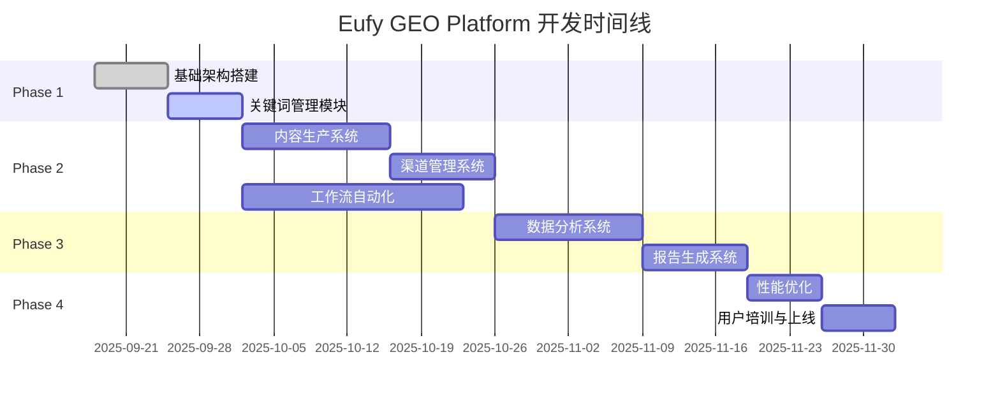
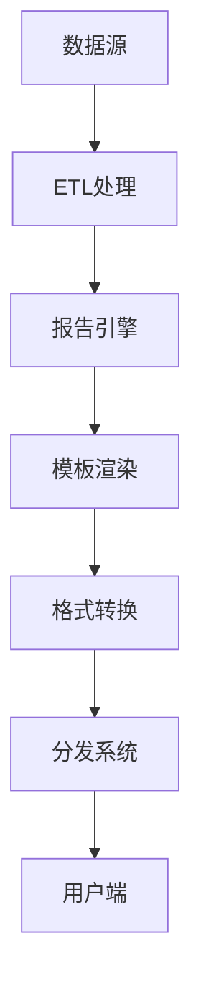
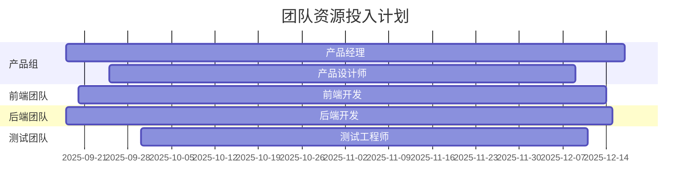
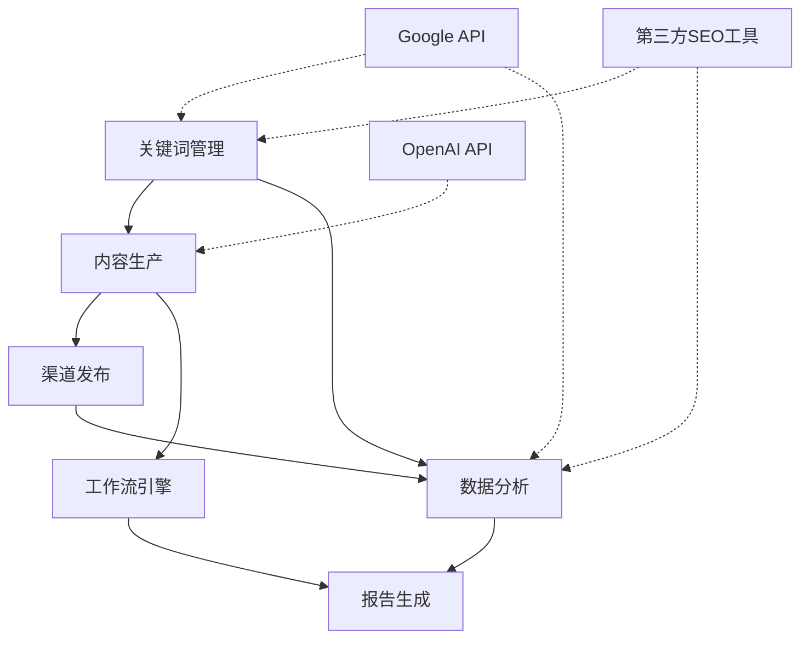
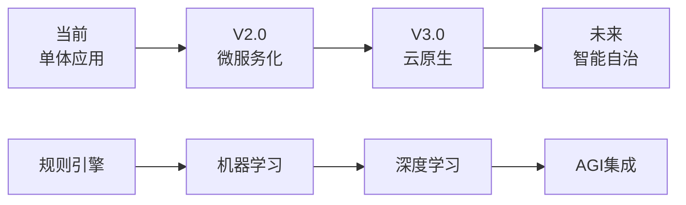

# PRP - Eufy GEO Platform 产品路线图计划
**Product Roadmap Plan**

---

## 文档信息
- **版本**: 1.0  
- **日期**: 2025-09-18
- **负责人**: 产品管理团队
- **相关文档**: PRD_Eufy_GEO_30天执行系统.md
- **状态**: 执行中

---

## 目录
1. [产品愿景与战略](#产品愿景与战略)
2. [发布计划概览](#发布计划概览)
3. [Phase 1: 基础集成（第1-2周）](#phase-1-基础集成第1-2周)
4. [Phase 2: 核心功能（第3-6周）](#phase-2-核心功能第3-6周)
5. [Phase 3: 高级功能（第7-10周）](#phase-3-高级功能第7-10周)
6. [Phase 4: 优化迭代（第11-12周）](#phase-4-优化迭代第11-12周)
7. [资源规划](#资源规划)
8. [风险评估与缓解](#风险评估与缓解)
9. [依赖关系管理](#依赖关系管理)
10. [成功指标追踪](#成功指标追踪)
11. [后续版本规划](#后续版本规划)

---

## 产品愿景与战略

### 愿景声明
将Eufy GEO Platform打造成智能家居行业领先的SEO执行平台，通过AI驱动的自动化工作流和数据智能，实现SEO效果的可预测、可复制和可规模化。

### 战略目标
1. **短期（Q1 2025）**
   - 完成核心功能开发，支持30天执行周期
   - 实现50%效率提升，25%流量增长
   - 建立行业最佳实践标准

2. **中期（Q2-Q3 2025）**
   - 扩展到全产品线SEO管理
   - AI准确率达到85%以上
   - 开始商业化探索

3. **长期（Q4 2025及以后）**
   - 成为SaaS产品对外服务
   - 支持多语言多市场
   - 建立生态系统

### 核心原则
- **用户至上**：每个功能都要解决实际痛点
- **数据驱动**：所有决策基于数据支撑
- **敏捷迭代**：快速试错，持续优化
- **开放协作**：预留扩展接口，支持生态建设

---

## 发布计划概览

### 时间线总览


### 里程碑节点
| 里程碑 | 日期 | 交付物 | 成功标准 |
|-------|------|--------|----------|
| M1: MVP就绪 | 2025-10-02 | 基础功能可用 | 内部测试通过 |
| M2: Beta发布 | 2025-10-30 | 核心功能完成 | 10个项目试运行 |
| M3: 正式上线 | 2025-11-20 | 全功能发布 | 50个项目迁移 |
| M4: 稳定运行 | 2025-12-18 | 优化完成 | 99.9%可用性 |

---

## Phase 1: 基础集成（第1-2周）
**时间**: 2025-09-18 至 2025-10-02

### 目标
- 搭建技术基础架构
- 实现关键词管理核心功能
- 建立开发规范和流程

### 交付内容

#### Week 1: 基础架构（09/18-09/24）
**开发任务**：
```yaml
infrastructure:
  - task: "环境搭建"
    components:
      - 开发/测试/生产环境配置
      - CI/CD pipeline搭建
      - 代码仓库和分支策略
    owner: "DevOps团队"
    duration: "3天"
  
  - task: "数据库设计"
    components:
      - ER图设计和评审
      - 数据库创建和初始化
      - 测试数据准备
    owner: "后端架构师"
    duration: "2天"
  
  - task: "API框架搭建"
    components:
      - GraphQL Schema定义
      - 认证授权中间件
      - 错误处理机制
    owner: "后端团队"
    duration: "3天"

  - task: "前端框架初始化"
    components:
      - Next.js项目搭建
      - UI组件库集成
      - 路由和状态管理
    owner: "前端团队"
    duration: "3天"
```

**验收标准**：
- [ ] 所有环境可正常访问
- [ ] 基础API可调通
- [ ] 前端可展示Hello World
- [ ] CI/CD可自动部署

#### Week 2: 关键词管理（09/25-10/02）
**功能清单**：
1. **关键词CRUD操作**
   - 创建/读取/更新/删除
   - 批量导入（CSV/Excel）
   - 搜索和筛选
   - 分页和排序

2. **P0-P5分级系统**
   - 自动分级算法实现
   - 手动调整功能
   - 分级可视化展示
   - 历史记录追踪

3. **基础数据集成**
   - Google Keyword Planner API
   - 搜索量数据同步
   - 竞争度指标计算
   - 数据更新调度

**测试计划**：
- 单元测试覆盖率>80%
- 集成测试全部通过
- 性能测试（1万关键词导入<10秒）
- 用户验收测试

### 资源需求
| 角色 | 人数 | 投入度 |
|-----|------|--------|
| 产品经理 | 1 | 100% |
| 技术负责人 | 1 | 100% |
| 后端开发 | 3 | 100% |
| 前端开发 | 2 | 100% |
| DevOps | 1 | 50% |
| 测试工程师 | 1 | 50% |

---

## Phase 2: 核心功能（第3-6周）
**时间**: 2025-10-03 至 2025-10-30

### 目标
- 完成内容生产全流程
- 实现多渠道管理
- 搭建自动化工作流

### 交付内容

#### Week 3-4: 内容生产系统（10/03-10/16）
**开发重点**：
1. **智能大纲生成器**
   ```typescript
   interface OutlineGenerator {
     generateOutline(keyword: Keyword): Promise<ContentOutline>
     analyzeCompetitors(keyword: Keyword): Promise<CompetitorInsights>
     suggestStructure(topic: string): Promise<HeadingStructure>
   }
   ```

2. **多格式编辑器**
   - Markdown编辑器集成
   - 实时预览功能
   - SEO评分计算
   - 协作编辑支持

3. **AI写作助手**
   - OpenAI API集成
   - Prompt工程优化
   - 内容质量控制
   - 原创性检查

**集成要求**：
- 与关键词模块数据打通
- 支持模板保存和复用
- 版本控制和回滚
- 多人协作冲突处理

#### Week 4-5: 渠道管理系统（10/10-10/23）
**渠道功能矩阵**：
| 渠道 | 优化功能 | API集成 | 自动化程度 |
|------|---------|---------|------------|
| Google | Title/Meta/Schema | Search Console | 80% |
| YouTube | 标题/描述/标签 | YouTube Data | 70% |
| Reddit | 社区分析/内容适配 | Reddit API | 60% |

**技术实现**：
1. **统一发布接口**
   ```graphql
   type Mutation {
     publishContent(
       contentId: ID!
       channels: [Channel!]!
       schedule: DateTime
     ): PublishResult!
   }
   ```

2. **渠道适配器**
   - 内容格式转换
   - 平台规则检查
   - 发布时间优化
   - 错误处理和重试

#### Week 5-6: 工作流引擎（10/17-10/30）
**工作流组件**：
```yaml
workflow_engine:
  components:
    - scheduler:
        type: "cron-based"
        features: ["定时任务", "依赖管理", "失败重试"]
    
    - task_queue:
        type: "Redis Queue"
        features: ["优先级队列", "并发控制", "进度追踪"]
    
    - notification:
        type: "multi-channel"
        channels: ["邮件", "钉钉", "站内信"]
    
    - approval_flow:
        type: "state-machine"
        states: ["待审核", "审核中", "已批准", "已拒绝"]
```

**30天模板实现**：
- Week 1模板：7个预定义任务
- Week 2模板：10个内容规划任务  
- Week 3模板：15个生产执行任务
- Week 4模板：8个分析优化任务

### 质量保证
1. **代码审查**
   - 每个PR必须2人审查
   - 自动化代码质量检查
   - 安全漏洞扫描

2. **测试策略**
   - TDD开发模式
   - E2E自动化测试
   - 压力测试和性能测试

3. **文档完善**
   - API文档自动生成
   - 用户操作手册
   - 视频教程录制

---

## Phase 3: 高级功能（第7-10周）
**时间**: 2025-10-31 至 2025-11-27

### 目标
- 实现数据智能分析
- 完成自动化报告
- 提升用户体验

### 交付内容

#### Week 7-8: 数据分析系统（10/31-11/13）
**分析能力建设**：
1. **数据采集层**
   ```javascript
   const dataSources = {
     google: {
       analytics: new GoogleAnalytics4API(),
       searchConsole: new SearchConsoleAPI(),
       ads: new GoogleAdsAPI()
     },
     thirdParty: {
       semrush: new SEMrushAPI(),
       ahrefs: new AhrefsAPI()
     },
     internal: {
       cms: new InternalCMSAPI(),
       crm: new InternalCRMAPI()
     }
   };
   ```

2. **分析引擎**
   - 实时数据处理pipeline
   - 多维度聚合分析
   - 机器学习预测模型
   - 异常检测算法

3. **可视化组件**
   - 20+图表类型
   - 交互式仪表板
   - 自定义视图
   - 移动端适配

**智能洞察功能**：
- 自动异常发现
- 趋势预测
- 机会识别
- 竞争情报

#### Week 9-10: 报告生成系统（11/14-11/27）
**报告能力矩阵**：
| 报告类型 | 生成频率 | 自动化程度 | 定制化程度 |
|---------|---------|------------|------------|
| 日报 | 每日 | 100% | 低 |
| 周报 | 每周 | 95% | 中 |
| 月报 | 每月 | 90% | 高 |
| 专题报告 | 按需 | 70% | 很高 |

**技术架构**：


### 性能优化
1. **前端优化**
   - 代码分割和懒加载
   - 图片和资源优化
   - Service Worker缓存
   - SSR/SSG优化

2. **后端优化**
   - 数据库查询优化
   - Redis缓存策略
   - API响应压缩
   - 并发处理优化

3. **基础设施**
   - CDN部署
   - 负载均衡
   - 自动扩缩容
   - 监控告警

---

## Phase 4: 优化迭代（第11-12周）
**时间**: 2025-11-28 至 2025-12-18

### 目标
- 系统性能优化
- 用户体验提升
- 培训和推广

### 优化方向

#### Week 11: 性能与稳定性（11/28-12/04）
**优化清单**：
1. **性能优化**
   - [ ] 首页加载时间<1.5秒
   - [ ] API响应P99<300ms
   - [ ] 报表生成时间减少50%
   - [ ] 内存使用优化30%

2. **稳定性提升**
   - [ ] 错误率降至0.1%以下
   - [ ] 自动故障恢复机制
   - [ ] 数据备份验证
   - [ ] 灾难恢复演练

3. **安全加固**
   - [ ] 渗透测试和修复
   - [ ] 权限系统审查
   - [ ] 数据加密升级
   - [ ] 合规性检查

#### Week 12: 上线与培训（12/05-12/18）
**上线准备**：
1. **数据迁移**
   - 历史数据导入
   - 数据一致性验证
   - 并行运行测试
   - 切换方案制定

2. **用户培训**
   - 管理员培训（4小时）
   - 用户培训（2小时）
   - 操作手册编写
   - FAQ文档准备

3. **运营准备**
   - 监控大屏搭建
   - 值班制度建立
   - 问题升级流程
   - 用户支持体系

### 发布策略


---

## 资源规划

### 团队组成
```
产品研发团队（核心团队）
├── 产品组（3人）
│   ├── 产品经理（1人）- 负责人
│   ├── 产品设计师（1人）
│   └── 用户研究员（1人）
│
├── 技术组（12人）
│   ├── 技术负责人（1人）
│   ├── 前端团队（4人）
│   │   ├── 前端负责人（1人）
│   │   └── 前端工程师（3人）
│   ├── 后端团队（5人）
│   │   ├── 后端负责人（1人）
│   │   ├── 后端工程师（3人）
│   │   └── 数据工程师（1人）
│   └── 基础架构（2人）
│       ├── DevOps工程师（1人）
│       └── 安全工程师（1人）
│
├── 质量保证组（3人）
│   ├── 测试负责人（1人）
│   ├── 测试工程师（2人）
│   └── 自动化测试（与测试工程师兼职）
│
└── 项目管理（1人）
    └── 项目经理/Scrum Master（1人）

支持团队（按需投入）
├── SEO专家（2人）- 业务指导
├── 数据分析师（1人）- 数据支持
├── UI/UX设计师（1人）- 界面优化
└── 技术文档工程师（1人）- 文档编写
```

### 预算估算
| 类别 | 明细 | 金额（万元） |
|-----|------|-------------|
| 人力成本 | 19人×3个月 | 285 |
| 基础设施 | 云服务、CDN等 | 30 |
| 第三方服务 | API、工具订阅 | 20 |
| 其他费用 | 培训、差旅等 | 15 |
| **总计** | | **350** |

### 资源利用计划


---

## 风险评估与缓解

### 风险矩阵
| 风险类型 | 可能性 | 影响度 | 风险等级 | 缓解措施 |
|---------|--------|--------|----------|----------|
| API限流导致数据获取失败 | 高 | 高 | 严重 | 1. 实施请求队列和限流<br>2. 购买高级API套餐<br>3. 建立数据缓存机制 |
| AI生成内容质量不达标 | 中 | 高 | 高 | 1. 建立质量评分模型<br>2. 人工审核机制<br>3. 持续优化Prompt |
| 团队关键人员离职 | 中 | 高 | 高 | 1. 知识文档化<br>2. 交叉培训<br>3. 激励机制优化 |
| 用户采用率低 | 中 | 中 | 中 | 1. 加强用户培训<br>2. 优化用户体验<br>3. 建立激励机制 |
| 技术架构扩展性不足 | 低 | 高 | 中 | 1. 采用微服务架构<br>2. 定期架构评审<br>3. 性能测试常态化 |
| 数据安全泄露 | 低 | 高 | 中 | 1. 加密存储传输<br>2. 权限严格控制<br>3. 安全审计定期 |

### 风险应对计划
```python
risk_response_plan = {
    "prevent": [
        "定期风险评审会议",
        "建立风险预警机制",
        "制定应急预案"
    ],
    "monitor": [
        "每周风险状态更新",
        "关键指标实时监控",
        "异常情况及时上报"
    ],
    "respond": [
        "启动应急响应流程",
        "调配备用资源",
        "及时沟通各方"
    ]
}
```

---

## 依赖关系管理

### 关键依赖项


### 外部依赖管理
| 依赖项 | 类型 | 影响范围 | 备选方案 |
|--------|------|----------|----------|
| Google APIs | 关键 | 数据采集、分析 | 1. SEMrush API<br>2. 自建爬虫 |
| OpenAI API | 重要 | AI内容生成 | 1. Claude API<br>2. 自建模型 |
| AWS/阿里云 | 关键 | 基础设施 | 多云部署策略 |
| Elasticsearch | 重要 | 搜索功能 | PostgreSQL全文索引 |

### 内部依赖协调
1. **跨团队协作**
   - 每日站会同步进度
   - 周会解决阻塞问题
   - 共享项目看板

2. **接口约定**
   - API先行设计
   - Mock数据支持
   - 版本化管理

3. **集成测试**
   - 持续集成环境
   - 自动化测试
   - 联调排期

---

## 成功指标追踪

### KPI Dashboard设计
```
┌─────────────────────────────────────────────┐
│           Eufy GEO Platform KPI              │
├─────────────────┬───────────────────────────┤
│ 业务指标         │ 产品指标                   │
├─────────────────┼───────────────────────────┤
│ 自然流量        │ 日活跃用户                 │
│ ▲ 125K (+25%)   │ ● 52 用户                  │
│                 │                            │
│ Top10关键词     │ 功能采用率                 │
│ ▲ 420 (+110%)   │ ████████░░ 82%            │
│                 │                            │
│ 内容产出        │ 系统稳定性                 │
│ ▲ 28篇/月       │ ████████████ 99.92%       │
│                 │                            │
│ ROI             │ 响应时间                   │
│ ▲ 2.6x          │ P95: 1.8s ✓               │
└─────────────────┴───────────────────────────┘
```

### 数据收集方案
1. **自动采集**
   - 应用埋点（Amplitude）
   - 性能监控（Datadog）
   - 错误追踪（Sentry）

2. **人工录入**
   - 业务数据月度更新
   - 用户反馈收集
   - 竞对情报录入

3. **定期报告**
   - 周度进度报告
   - 月度KPI报告
   - 季度复盘总结

### 成功标准Checklist
**Phase 1完成标准**：
- [ ] 基础架构搭建完成
- [ ] 关键词模块上线
- [ ] 导入10,000+关键词
- [ ] 5个项目试用

**Phase 2完成标准**：
- [ ] 内容生产流程打通
- [ ] 3个渠道集成完成
- [ ] 工作流引擎运行
- [ ] 效率提升25%+

**Phase 3完成标准**：
- [ ] 数据分析全覆盖
- [ ] 自动报告生成
- [ ] 智能洞察准确
- [ ] 用户满意度4.0+

**Phase 4完成标准**：
- [ ] 系统稳定性99.9%
- [ ] 全员培训完成
- [ ] 50个项目迁移
- [ ] ROI达到2.5x

---

## 后续版本规划

### V2.0 规划（2026 Q1）
**主题**：智能化升级
1. **AI能力增强**
   - 自建SEO专用模型
   - 多模态内容生成
   - 智能内容优化

2. **自动化深化**
   - 全流程自动化
   - 智能决策支持
   - 预测性维护

3. **个性化定制**
   - 行业模板库
   - 自定义工作流
   - 个性化推荐

### V3.0 愿景（2026 Q2-Q3）
**主题**：生态化发展
1. **平台开放**
   - 开发者API
   - 插件市场
   - 集成生态

2. **商业化**
   - SaaS版本
   - 企业定制
   - 咨询服务

3. **国际化**
   - 多语言支持
   - 本地化策略
   - 全球部署

### 长期技术演进


---

## 总结

### 关键成功因素
1. **团队协作**：跨职能团队紧密配合
2. **敏捷迭代**：快速响应和持续改进
3. **用户导向**：深入理解和满足用户需求
4. **技术创新**：采用先进技术提升竞争力
5. **数据驱动**：基于数据做出明智决策

### 期望成果
- **效率提升**：SEO执行效率提升50%以上
- **效果改善**：自然流量增长25%以上
- **成本降低**：人力成本节省40%
- **竞争优势**：建立行业领先地位

### 下一步行动
1. **立即启动**：组建团队，启动Phase 1开发
2. **每周复盘**：跟踪进度，及时调整
3. **持续沟通**：保持各方信息同步
4. **快速迭代**：根据反馈持续优化

---

**文档批准**

| 角色 | 姓名 | 确认 | 日期 |
|-----|------|------|------|
| CEO/总经理 | ___ | ___ | ___ |
| 产品VP | ___ | ___ | ___ |
| 技术VP | ___ | ___ | ___ |
| 运营VP | ___ | ___ | ___ |
| 项目经理 | ___ | ___ | ___ |

---

**版本历史**

| 版本 | 日期 | 变更内容 | 责任人 |
|-----|------|----------|--------|
| 1.0 | 2025-09-18 | 初始版本发布 | 产品团队 |