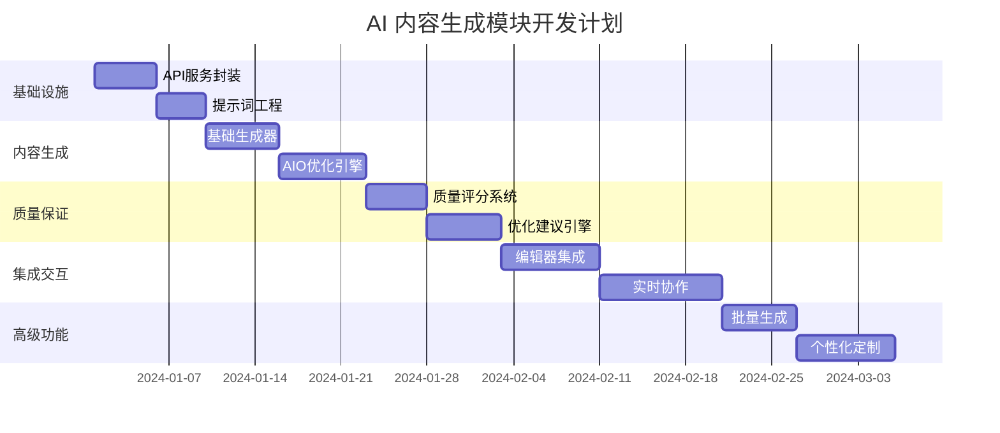

# Epic: AI 内容生成模块

*Generated using Sequential Thinking MCP for systematic task decomposition*

## 🎯 Epic 概述

构建智能化的 AI 内容生成系统，支持基于关键词的自动内容创作、AIO 优化建议、实时协作编辑，帮助内容创作者提升效率和质量。

## 🔄 任务分解架构

### 第一层：基础设施层

#### Story 1.1: AI API 服务封装
**优先级**: P0 (关键路径)  
**估时**: 5 天  
**验收标准**:
- [ ] OpenAI GPT-4 API 集成
- [ ] Claude API 备用集成 
- [ ] API 调用限流和重试机制
- [ ] 使用配额监控和告警
- [ ] 响应缓存机制

```typescript
// ai.service.ts
@Injectable()
export class AIService {
  private openaiClient: OpenAI;
  private claudeClient: Anthropic;
  private rateLimiter: RateLimiter;
  
  async generateContent(prompt: string, options: GenerationOptions): Promise<string> {
    // 配额检查
    await this.checkQuota(options.userId);
    
    // 缓存检查
    const cached = await this.getCachedResponse(prompt);
    if (cached) return cached;
    
    // API 调用
    const response = await this.callPrimaryAPI(prompt, options);
    
    // 缓存结果
    await this.cacheResponse(prompt, response);
    
    return response;
  }
}
```

#### Story 1.2: 提示词工程系统
**优先级**: P0  
**估时**: 4 天  
**验收标准**:
- [ ] 结构化提示词模板
- [ ] 动态提示词组装
- [ ] A/B 测试框架
- [ ] 提示词版本管理

### 第二层：内容生成层

#### Story 2.1: 基础内容生成器
**优先级**: P0  
**估时**: 6 天  
**验收标准**:
- [ ] 关键词到内容大纲生成
- [ ] 多种内容格式支持 (文章/视频脚本/社区帖子)
- [ ] 内容长度控制
- [ ] 语言风格适配

```typescript
interface ContentGenerationRequest {
  keyword: string;
  contentType: 'article' | 'video_script' | 'reddit_post';
  targetLength: number;
  tone: 'professional' | 'casual' | 'technical';
  aioOptimized: boolean;
}

class ContentGenerator {
  async generateBrief(request: ContentGenerationRequest): Promise<ContentBrief> {
    const prompt = this.buildPrompt(request);
    const response = await this.aiService.generateContent(prompt);
    return this.parseResponse(response);
  }
  
  private buildPrompt(request: ContentGenerationRequest): string {
    return `
      Generate a ${request.contentType} about "${request.keyword}".
      Target length: ${request.targetLength} words.
      Tone: ${request.tone}.
      ${request.aioOptimized ? 'Optimize for AI-generated search results.' : ''}
      
      Requirements:
      - Structure with clear headings
      - Include FAQ section
      - Add call-to-action
      - Ensure SEO optimization
    `;
  }
}
```

#### Story 2.2: AIO 优化引擎
**优先级**: P1  
**估时**: 7 天  
**验收标准**:
- [ ] AIO 内容结构分析
- [ ] 结构化数据生成
- [ ] 答案型内容优化
- [ ] 竞争内容分析

### 第三层：质量保证层

#### Story 3.1: 内容质量评分系统
**优先级**: P1  
**估时**: 5 天  
**验收标准**:
- [ ] 多维度质量评分 (相关性、可读性、SEO、AIO 适配度)
- [ ] 实时质量反馈
- [ ] 改进建议生成
- [ ] 质量历史追踪

```typescript
interface QualityScore {
  overall: number;  // 0-100
  relevance: number;  // 关键词相关性
  readability: number;  // 可读性
  seoOptimization: number;  // SEO 优化度
  aioCompatibility: number;  // AIO 兼容性
  originalityScore: number;  // 原创性
}

class QualityAssessment {
  async evaluateContent(content: string, keyword: string): Promise<QualityScore> {
    const [relevance, readability, seo, aio, originality] = await Promise.all([
      this.assessRelevance(content, keyword),
      this.assessReadability(content),
      this.assessSEO(content, keyword),
      this.assessAIOCompatibility(content),
      this.assessOriginality(content)
    ]);
    
    const overall = (relevance + readability + seo + aio + originality) / 5;
    
    return { overall, relevance, readability, seoOptimization: seo, aioCompatibility: aio, originalityScore: originality };
  }
}
```

#### Story 3.2: 内容优化建议引擎
**优先级**: P1  
**估时**: 6 天  
**验收标准**:
- [ ] 自动检测优化机会
- [ ] 具体改进建议生成
- [ ] 优化前后对比
- [ ] 一键应用优化

### 第四层：集成交互层

#### Story 4.1: 编辑器集成
**优先级**: P0  
**估时**: 8 天  
**验收标准**:
- [ ] Lexical 编辑器插件开发
- [ ] AI 助手侧边栏
- [ ] 实时优化提示
- [ ] 快捷操作按钮

```tsx
// AIAssistantPlugin.tsx
function AIAssistantPlugin(): JSX.Element {
  const [editor] = useLexicalComposerContext();
  const [suggestions, setSuggestions] = useState<Suggestion[]>([]);
  
  useEffect(() => {
    const unregister = editor.registerTextContentListener((textContent) => {
      // 实时分析内容并提供建议
      analyzeContentRealtime(textContent).then(setSuggestions);
    });
    
    return unregister;
  }, [editor]);
  
  return (
    <div className="ai-assistant-panel">
      <h3>AI 写作助手</h3>
      
      <div className="suggestions">
        {suggestions.map((suggestion, index) => (
          <SuggestionCard 
            key={index} 
            suggestion={suggestion}
            onApply={() => applySuggestion(editor, suggestion)}
          />
        ))}
      </div>
      
      <div className="quick-actions">
        <Button onClick={() => generateOutline(editor)}>
          生成大纲
        </Button>
        <Button onClick={() => optimizeForAIO(editor)}>
          AIO 优化
        </Button>
        <Button onClick={() => improveSEO(editor)}>
          SEO 优化
        </Button>
      </div>
    </div>
  );
}
```

#### Story 4.2: 实时协作系统
**优先级**: P2  
**估时**: 10 天  
**验收标准**:
- [ ] 多用户同时编辑
- [ ] 操作同步和冲突解决
- [ ] 用户状态显示
- [ ] 评论和建议系统

### 第五层：高级功能层

#### Story 5.1: 批量内容生成
**优先级**: P2  
**估时**: 6 天  
**验收标准**:
- [ ] 批量关键词处理
- [ ] 模板化生成
- [ ] 进度跟踪
- [ ] 结果导出

#### Story 5.2: 内容个性化定制
**优先级**: P3  
**估时**: 8 天  
**验收标准**:
- [ ] 用户写作风格学习
- [ ] 个性化建议
- [ ] 品牌语调适配
- [ ] 行业专业术语库

## 📊 开发时间线



## 🧪 测试策略

### 单元测试 (覆盖率 >90%)
```typescript
// ai.service.test.ts
describe('AIService', () => {
  it('应该正确生成内容大纲', async () => {
    const result = await aiService.generateContent(
      'smart doorbell',
      { contentType: 'article', targetLength: 1000 }
    );
    
    expect(result).toContain('introduction');
    expect(result).toContain('features');
    expect(result).toContain('conclusion');
  });
  
  it('应该处理 API 限流', async () => {
    // 模拟 API 限流情况
    jest.spyOn(aiService, 'callAPI').mockRejectedValue(new RateLimitError());
    
    const result = await aiService.generateContent('test prompt');
    
    // 应该自动重试
    expect(aiService.callAPI).toHaveBeenCalledTimes(3);
  });
});
```

### 集成测试
- API 集成可靠性测试
- 缓存机制验证测试
- 并发请求处理测试
- 错误恢复机制测试

### 性能测试
- 响应时间基准测试 (<3秒)
- 并发用户负载测试 (100+ 用户)
- 内存使用优化验证
- API 成本控制验证

### 质量测试
- 生成内容质量人工评估
- AIO 优化效果验证
- 用户满意度调研 (SUS >80分)

## 🔒 风险管理

| 风险类型 | 影响等级 | 缓解策略 |
|---------|---------|----------|
| API 成本超支 | 高 | 严格配额控制 + 实时监控 |
| 内容质量不稳定 | 中 | 多模型备用 + 质量检查 |
| 响应时间过长 | 中 | 缓存优化 + 异步处理 |
| 用户体验问题 | 中 | 快速迭代 + 用户反馈 |

## ✅ 验收标准

### 功能验收
- [ ] 所有用户故事 100% 完成
- [ ] 核心功能端到端测试通过
- [ ] 性能指标达到预期
- [ ] 安全测试通过

### 质量验收
- [ ] 代码覆盖率 >90%
- [ ] 生成内容质量评分 >80分
- [ ] 用户满意度 >85%
- [ ] 系统稳定性 >99%

---

*此 Epic 通过 Sequential Thinking 系统化分解，确保 AI 内容生成模块的高质量交付。*