# MCP 服务器集成自动化开发策略

*Comprehensive MCP Server Integration for Automated Development*

## 🎯 集成目标

通过 SuperClaude 的 MCP 服务器生态系统，实现 Eufy GEO 平台的自动化开发、测试、部署和运维全流程。

## 🔧 可用 MCP 服务器矩阵

### 核心开发服务器

#### 1. Sequential Thinking
**用途**: 复杂问题分解和系统化思考  
**集成场景**:
- 架构设计决策分析
- 复杂功能模块分解
- 技术方案比较评估
- 风险分析和缓解策略

**实际应用示例**:
```bash
# 使用 Sequential Thinking 分析数据库性能优化
当数据库查询性能成为瓶颈时，通过多步思考分析：
1. 识别性能瓶颈点
2. 分析根本原因
3. 评估解决方案
4. 制定实施计划
5. 验证优化效果
```

#### 2. Puppeteer Browser Automation
**用途**: E2E 测试和浏览器自动化  
**集成场景**:
- 自动化测试关键用户流程
- 性能基准测试
- 跨浏览器兼容性验证
- 截图和视觉回归测试

**自动化测试配置**:
```typescript
// e2e/keyword-management.spec.ts
import { test, expect } from '@playwright/test';

test('关键词导入流程', async ({ page }) => {
  // 登录
  await page.goto('/login');
  await page.fill('[name=email]', 'admin@eufy-geo.com');
  await page.fill('[name=password]', 'Admin123!');
  await page.click('button[type=submit]');
  
  // 导入关键词
  await page.goto('/keywords');
  await page.click('text=导入关键词');
  
  // 上传文件
  const fileInput = page.locator('input[type=file]');
  await fileInput.setInputFiles('./test-data/keywords.csv');
  
  // 验证导入结果
  await expect(page.locator('.ant-message-success')).toBeVisible();
  await expect(page.locator('[data-testid=keyword-count]')).toContainText('850');
});
```

#### 3. Magic UI Component Generation
**用途**: AI 驱动的 UI 组件生成  
**集成场景**:
- 快速原型制作
- 组件库扩展
- 设计系统实现
- 响应式布局生成

**组件生成示例**:
```tsx
// 使用 Magic 生成关键词优先级可视化组件
const KeywordPyramidChart = generateComponent({
  description: "显示 P0-P4 关键词分层的金字塔图表，支持交互点击和数据钻取",
  requirements: [
    "使用 ECharts 渲染",
    "支持点击层级查看详情",
    "响应式设计",
    "颜色主题可配置"
  ],
  data: {
    p0: { count: 8, coverage: 0.75 },
    p1: { count: 9, coverage: 0.45 },
    p2: { count: 19, coverage: 0.25 },
    p3: { count: 230, coverage: 0.15 },
    p4: { count: 591, coverage: 0.05 }
  }
});
```

### 数据和存储服务器

#### 4. Memory (Knowledge Graph)
**用途**: 知识图谱持久化和语义搜索  
**集成场景**:
- 项目知识管理
- 技术决策历史记录
- 最佳实践积累
- 问题解决方案库

**知识管理示例**:
```typescript
// 记录技术决策
await memoryService.storeDecision({
  decision: "选择 PostgreSQL 作为主数据库",
  context: "需要 ACID 特性和复杂查询支持",
  alternatives: ["MongoDB", "MySQL"],
  rationale: "关系型数据模型更适合关键词和内容的关联查询",
  date: new Date(),
  author: "架构师"
});

// 查询相似问题的解决方案
const solutions = await memoryService.findSimilarSolutions(
  "数据库性能优化"
);
```

#### 5. SQLite Local Analytics
**用途**: 本地数据分析和报表生成  
**集成场景**:
- 开发过程指标收集
- 本地测试数据分析
- 性能基准数据存储
- 离线数据处理

#### 6. Filesystem Advanced Operations
**用途**: 高级文件操作和代码生成  
**集成场景**:
- 自动代码生成
- 项目模板创建
- 批量文件操作
- 配置文件管理

**代码生成示例**:
```typescript
// 自动生成 GraphQL 解析器
await filesystemService.generateFromTemplate({
  template: 'graphql-resolver',
  data: {
    entityName: 'Keyword',
    fields: ['text', 'searchVolume', 'priority'],
    operations: ['create', 'update', 'delete', 'list']
  },
  outputPath: './backend/src/modules/keyword/keyword.resolver.ts'
});
```

### 集成和协作服务器

#### 7. Git/GitHub Integration
**用途**: 版本控制和 CI/CD 集成  
**集成场景**:
- 自动化代码审查
- 分支管理策略
- 发布流程自动化
- 问题跟踪集成

**自动化工作流示例**:
```yaml
# .github/workflows/auto-review.yml
name: Automated Code Review
on:
  pull_request:
    types: [opened, synchronize]

jobs:
  auto-review:
    runs-on: ubuntu-latest
    steps:
      - uses: actions/checkout@v3
      - name: AI Code Review
        uses: ./actions/ai-review
        with:
          github-token: ${{ secrets.GITHUB_TOKEN }}
          review-rules: |
            - 检查代码规范遵循
            - 验证测试覆盖率
            - 分析性能影响
            - 评估安全性
```

## 🔄 自动化开发工作流

### Phase 1: 需求分析自动化

```mermaid
graph LR
    A[需求输入] --> B[Sequential Thinking 分析]
    B --> C[Memory 查询历史方案]
    C --> D[生成技术方案]
    D --> E[方案评估和选择]
```



**实施示例**:
```typescript
// 自动化需求分析流程
class AutomatedRequirementAnalysis {
  async analyzeRequirement(requirement: string): Promise<AnalysisResult> {
    // 1. 使用 Sequential Thinking 分解需求
    const breakdown = await this.sequentialThinking.analyze(requirement);
    
    // 2. 查询 Memory 中的相似解决方案
    const similarSolutions = await this.memory.findSimilar(requirement);
    
    // 3. 生成技术方案
    const technicalSolution = await this.generateSolution(breakdown, similarSolutions);
    
    // 4. 评估方案可行性
    const feasibilityScore = await this.evaluateFeasibility(technicalSolution);
    
    return {
      breakdown,
      similarSolutions,
      technicalSolution,
      feasibilityScore
    };
  }
}
```

### Phase 2: 代码生成自动化

```mermaid
graph LR
    A[技术方案] --> B[Magic UI 生成]
    B --> C[Filesystem 代码生成]
    C --> D[Git 自动提交]
    D --> E[Puppeteer 自动测试]
```



**实施示例**:
```typescript
// 自动化代码生成流程
class AutomatedCodeGeneration {
  async generateModule(spec: ModuleSpec): Promise<GenerationResult> {
    // 1. 生成前端组件
    const uiComponents = await this.magic.generateComponents(spec.ui);
    
    // 2. 生成后端代码
    const backendCode = await this.filesystem.generateFromTemplates({
      entities: spec.entities,
      apis: spec.apis,
      tests: spec.tests
    });
    
    // 3. 自动提交到 Git
    await this.git.createBranch(`feature/${spec.name}`);
    await this.git.commit(`Auto-generated: ${spec.description}`);
    
    // 4. 运行自动化测试
    const testResults = await this.puppeteer.runE2ETests();
    
    return { uiComponents, backendCode, testResults };
  }
}
```

### Phase 3: 质量保证自动化

```mermaid
graph LR
    A[代码提交] --> B[Puppeteer E2E 测试]
    B --> C[性能基准测试]
    C --> D[代码质量分析]
    D --> E[自动化部署]
```



### Phase 4: 运维监控自动化

```mermaid
graph LR
    A[系统运行] --> B[SQLite 指标收集]
    B --> C[Memory 问题诊断]
    C --> D[自动化修复]
    D --> E[Git 记录变更]
```



## 📊 自动化开发仪表板

创建一个统一的自动化开发监控界面：

```typescript
// AutomationDashboard.tsx
interface AutomationMetrics {
  codeGenerationRate: number;  // 代码生成速度
  testAutomationCoverage: number;  // 自动化测试覆盖率
  deploymentFrequency: number;  // 部署频率
  issueResolutionTime: number;  // 问题解决时间
  qualityScore: number;  // 代码质量评分
}

function AutomationDashboard() {
  const [metrics, setMetrics] = useState<AutomationMetrics>();
  const [mcpStatus, setMcpStatus] = useState<MCPServerStatus[]>();
  
  return (
    <div className="automation-dashboard">
      <h1>🤖 自动化开发中心</h1>
      
      <div className="metrics-grid">
        <MetricCard 
          title="代码生成效率"
          value={`${metrics?.codeGenerationRate}x`}
          trend="up"
        />
        <MetricCard 
          title="测试覆盖率"
          value={`${metrics?.testAutomationCoverage}%`}
          trend="up"
        />
        <MetricCard 
          title="部署频率"
          value={`${metrics?.deploymentFrequency}/day`}
          trend="stable"
        />
      </div>
      
      <div className="mcp-servers">
        <h2>MCP 服务器状态</h2>
        {mcpStatus?.map(server => (
          <ServerStatusCard key={server.name} server={server} />
        ))}
      </div>
      
      <div className="automation-workflows">
        <h2>自动化工作流</h2>
        <WorkflowList />
      </div>
    </div>
  );
}
```

## 🎯 综合能力利用示例

### 实际开发场景：关键词分析功能开发

**步骤 1: 需求分析**
```bash
使用 Sequential Thinking 分解需求：
"开发一个关键词竞争分析功能，展示竞争对手在同一关键词上的排名情况"
```

**步骤 2: 方案设计**
```typescript
// 查询 Memory 中相似功能的实现方案
const similarFeatures = await memory.query("竞争分析功能");

// 生成技术方案
const solution = {
  backend: "Neo4j 图数据库存储竞争关系",
  frontend: "ECharts 可视化组件",
  dataSource: "SerpAPI 获取实时排名数据"
};
```

**步骤 3: 自动化实现**
```typescript
// Magic 生成前端组件
const CompetitorChart = await magic.generateComponent({
  type: "scatter-plot",
  data: "竞争对手排名数据",
  interactive: true
});

// Filesystem 生成后端 API
await filesystem.generateAPI({
  endpoint: "/api/competitors/analysis",
  method: "GET",
  response: "CompetitorAnalysisResult"
});
```

**步骤 4: 自动化测试**
```typescript
// Puppeteer 生成 E2E 测试
await puppeteer.generateTest({
  scenario: "用户查看关键词竞争分析",
  steps: [
    "打开关键词详情页",
    "点击竞争分析标签",
    "验证图表正确渲染",
    "测试交互功能"
  ]
});
```

**步骤 5: 自动化部署**
```typescript
// Git 自动化提交和部署
await git.createPR({
  title: "feat: 添加关键词竞争分析功能",
  description: "自动生成的竞争分析功能实现",
  reviewers: ["tech-lead"]
});
```

## 🚀 实施建议

### 1. 分阶段启用
- **Week 1-2**: 启用 Sequential Thinking + Memory
- **Week 3-4**: 集成 Puppeteer + Filesystem
- **Week 5-6**: 添加 Magic + Git 集成
- **Week 7-8**: 完整工作流优化

### 2. 监控和优化
- 跟踪自动化节省的开发时间
- 监控生成代码的质量
- 收集团队使用反馈
- 持续优化工作流

### 3. 团队培训
- MCP 服务器使用培训
- 自动化工作流最佳实践
- 问题排查和故障恢复
- 持续改进文化建设

通过这种综合性的 MCP 服务器集成策略，Eufy GEO 平台的开发效率将提升 3-5 倍，同时确保代码质量和系统稳定性。